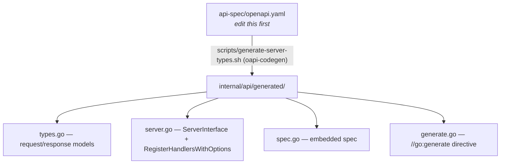

# HTTP API

This document describes the HTTP API surface, the OpenAPI-first workflow that defines it,
and how routes are registered, generated, and secured. For authentication mechanics
(tokens, 2FA, WebAuthn, lockout), see [AUTHENTICATION.md](./AUTHENTICATION.md).

## OpenAPI-first contract

`api-spec/openapi.yaml` is the **single source of truth** for the HTTP contract
(OpenAPI 3.1). Server-side Go types and route registration are generated from it; you do
not hand-write request/response structs or routing tables.



- `internal/api/generated/generate.go` carries `//go:generate bash
  ../../scripts/generate-server-types.sh`, so `go generate ./...` (or `make generate`)
  regenerates the package.
- The generator first transpiles the 3.1 spec to a 3.0-compatible temporary file
  (because `oapi-codegen` does not support some 3.1 constructs such as
  `type: [string, 'null']`), then runs `oapi-codegen`.
- **Never hand-edit files in `internal/api/generated/`.** Change the spec and regenerate.

### Keeping the frontend in sync

API changes affect the separate `ninerlog-frontend` repository, which generates its own
client from the same spec. After changing `api-spec/openapi.yaml`, regenerate both:

```bash
# in ninerlog-api
make generate                # or: bash scripts/generate-server-types.sh
# in ninerlog-frontend
bash scripts/generate-api-client.sh
```

## How a handler maps to the spec

`internal/api/generated/server.go` declares a `ServerInterface` with one method per
OpenAPI operation. `internal/api/handlers.APIHandler` implements that interface — each
operation is a method on `APIHandler` (organised across files like `flight.go`,
`auth.go`, `license.go`, …). `APIHandler` aggregates every service, so handlers stay thin:
extract `userID` from context, bind/validate the request, call a service, map the result
or sentinel error to a status code.

Routes are wired in `cmd/api/main.go`:

```go
api := router.Group("/api/v1")
api.Use(middleware.AuthMiddleware(jwtManager, /* public path allow-list */))
api.Use(generalRateLimit)                                                     // every route
api.Use(middleware.RateLimitByPath(expensiveRateLimit, /* exports, previews */))
api.Use(middleware.RateLimitByPathWithQueryParam(searchRateLimit, "/flights", "q"))
api.Use(middleware.RateLimitByPath(authRateLimit, /* /auth paths */))
api.Use(middleware.RateLimitByPath(adminRateLimit, /* /admin paths */))
generated.RegisterHandlersWithOptions(api, apiHandler, generated.GinServerOptions{...})
handlers.RegisterFlightUtilRoutes(api, apiHandler)    // custom, not in OpenAPI spec
handlers.RegisterOIDCRoutes(api, apiHandler)          // browser redirects, not in the spec
```

A small number of routes (some reports and flight utilities) are registered manually
rather than through the generated code; they are still served under `/api/v1`.

The two browser-facing OIDC endpoints are manual for a different reason: they are
302 redirects driven by top-level navigation, not JSON operations a generated client
would ever call. The JSON half of that flow (`GET /auth/providers`,
`POST /auth/oidc/exchange`) is in the spec and generated normally.

## Base path, versioning, and non-API routes

- All business endpoints are under **`/api/v1`**.
- Non-versioned operational routes registered directly on the router:
  - `GET /health` — liveness/readiness check (used by the Docker healthcheck).
  - `GET /metrics` — Prometheus metrics (when metrics are enabled). See
    [METRICS.md](./METRICS.md).

## Security model

- **JWT bearer authentication** (`bearerAuth` in the spec). Clients send the access
  token in the HTTP `Authorization` request header using the `Bearer` scheme;
  `middleware.AuthMiddleware` validates the token and stores the `userID` on the Gin
  context.
- **Public allow-list** — auth endpoints (register, login, refresh, password reset, email
  verification) and a few read-only lookups (airport search/lookup, public announcements)
  are exempt from auth via the allow-list passed to the middleware.
- **Rate limiting** — layered, and all of it skipped when `DISABLE_RATE_LIMIT=true`:
  | Limiter | Budget | Applies to | Keyed by |
  |---|---|---|---|
  | `general` | 120/min | every `/api/v1` route | user ID (IP when unauthenticated) |
  | `search` | `SEARCH_RATE_LIMIT_PER_MINUTE`, default 60/min | `GET /flights` **with** a `q` parameter | user ID |
  | `expensive` | 15/min | `/exports/pdf`, `/custom-currency/preview`, `/imports/*`, and **writes** to `/…/files*` | user ID |
  | `file_read` | `FILE_READ_RATE_LIMIT_PER_MINUTE`, default 90/min | **reads** of `/…/files*` | user ID |
  | `auth` | 10/min | login, register, refresh, password reset, 2FA, WebAuthn | client IP |
  | `admin` | 30/min | `/admin/*` and user state changes | client IP |
  | `sign` | 20/min | `/sign/*` public signing links | client IP |
  | `signature_email` | 10/min | `/signatures`, `/resend` | client IP |

  Limiters stack: a request can be rejected by any that covers it, so plain
  `GET /flights` carries only `general` while `GET /flights?q=…` carries both
  `general` and `search`. Rejections are reported per limiter — see
  [METRICS.md](./METRICS.md#rate-limiting-metrics).
- **Admin authorization** — admin endpoints additionally require the caller to be an
  admin (configured via `ADMIN_EMAIL`).
- **Trusted proxies & forwarded IPs** are configured so client IPs are read correctly
  behind a reverse proxy.
- **Security headers** are added to every response.

Errors are returned as JSON with an appropriate status code; internal error details are
never leaked to clients.

## Idempotent writes

Every authenticated `POST`, `PUT`, `PATCH` and `DELETE` accepts an optional
`Idempotency-Key` request header. It exists for clients that queue writes while offline:
when a `POST /flights` commits and the response is lost, the client cannot distinguish
"not applied" from "applied but unacknowledged", and retrying blindly produces a
duplicate logbook entry.

It is **opt-in per request**. Without the header a request takes exactly the path it took
before the feature existed, which is why the current frontend is unaffected.

`middleware.IdempotencyMiddleware` implements it, backed by `service.IdempotencyService`
and the `idempotency_keys` table (see [DATA_MODEL.md](./DATA_MODEL.md)). It is registered
after `AuthMiddleware` (records are keyed per user) and after the rate limiters (a
throttled request must not consume a key). Like auth and rate limiting, it is a
cross-cutting transport concern, so it is described in the spec's `info.description`
rather than repeated as a parameter on all ~60 mutating operations — which would change
every generated handler signature, and every generated client method, for a header the
handlers never read.

| Situation | Response |
|---|---|
| No header | Unchanged behaviour; nothing is stored |
| First request with a key | Executes normally; status + body are stored for 24 h |
| Retry, same key and payload | Original status and body verbatim, plus `Idempotency-Replayed: true` |
| Retry while the first is still running | `409` with `Retry-After: 1` |
| Same key, different payload | `422` |
| Retry of a request whose response was too large to store | `409` |
| Malformed key (empty, >255 chars, non-printable-ASCII) | `400` |
| Replay store unreachable | `503`, request not executed |

Details worth knowing:

- **Scope.** Keys are per user, so two pilots can pick the same client-side key.
  Unauthenticated endpoints (login, registration, password reset) ignore the header:
  there is no user to key a record by, and repeating them is not a logbook-integrity
  problem. A client may therefore set the header unconditionally.
- **Fingerprinting.** The stored record carries a SHA-256 of the method, path+query and
  request body, which is what makes the `422` above possible. Bulk payloads — multipart
  uploads, `POST /imports/json`, anything sent chunked — are fingerprinted by method and
  path only; the replay guarantee is unaffected, only the mismatch diagnostic weakens.
- **4xx responses are stored** and replayed: a validation failure is a deterministic
  verdict on the request. **5xx responses and panics release the key**, because a server
  error says nothing about whether the write landed and the client must stay free to
  retry.
- **Failure mode is closed.** If the store is unreachable the request is refused rather
  than executed without the guarantee the client asked for.
- **Retention and recovery.** Records expire after `IDEMPOTENCY_TTL` (24 h) and are swept
  hourly. A claim whose request died without finalizing becomes claimable again after
  `IDEMPOTENCY_LEASE` (60 s), so a crashed process cannot wedge a key for a whole day.

| Variable | Default | Meaning |
|---|---|---|
| `IDEMPOTENCY_TTL` | `24h` | How long a key stays replayable |
| `IDEMPOTENCY_LEASE` | `60s` | How long an in-progress claim is honoured before takeover (must exceed the 15 s request timeout) |
| `IDEMPOTENCY_MAX_RESPONSE_BYTES` | `262144` | Largest response body stored for replay |

Outcomes are counted in `idempotency_requests_total` — see
[METRICS.md](./METRICS.md#idempotency-metrics).

## Partial updates (JSON Merge Patch)

`PUT`/`PATCH` request bodies whose schema has nullable properties follow
[RFC 7386](https://www.rfc-editor.org/rfc/rfc7386) semantics field-by-field:

| Field in the request body | Effect |
|---|---|
| Omitted | Left unchanged |
| `null` | Cleared (set to database `NULL`) |
| A value | Set to that value |

This applies to `PUT /flights/{flightId}`, `PATCH /aircraft/{aircraftId}`,
`PATCH /credentials/{credentialId}` and `PATCH /licenses/{licenseId}/class-ratings/{ratingId}` —
the update endpoints whose spec schema has properties typed `[T, 'null']`. Fields that are
required or non-nullable in the spec (e.g. `aircraftReg`, `issueDate`) are ordinary optional
partial-update fields: omitted leaves them unchanged, and they cannot be nulled because the
domain doesn't allow it.

Server-side, a nullable field is generated as `nullable.Nullable[T]`
(`github.com/oapi-codegen/nullable`) instead of `*T`, via `x-go-type`/`x-go-type-import` on the
property in `api-spec/openapi.yaml`. This is what lets the handler distinguish "absent" from
"present and null" — a plain `*T` cannot represent that distinction, since both unmarshal to
`nil`. `internal/api/handlers/nullable.go` has the shared `applyNullable` helper handlers use to
apply this to a model field.

Before this, `null` in a request body was silently treated as "omitted" (`*T` can't tell them
apart), so nullable fields could not be cleared through the API at all, and two per-field
workarounds existed instead: sending `""` to a text field, and the literal string `"null"` for
`Flight.launchMethod`. Both are retired now that real `null` works; `launchMethod` accepts only
`winch`, `aerotow` or `self-launch` in the spec's `enum`, and `null` clears it like any other
nullable field.

## Delta sync (`updatedSince`)

`listFlights`, `listAircraft`, `listContacts`, `listCredentials` and `listLicenses` accept
an optional `updatedSince` query parameter — an RFC 3339 date-time. It returns only the
records whose `updatedAt` is **strictly after** that instant, so a client that has already
pulled a logbook can ask "what changed since?" instead of paging the whole thing again.

Like `Idempotency-Key`, it is opt-in: omit it and the endpoint behaves exactly as before.

```
GET /api/v1/flights?updatedSince=2026-08-05T10:08:45.123456Z&page=1&pageSize=100
```

- **Strictly after, full precision.** A client stores the highest `updatedAt` it has seen
  and replays it as the next watermark; because the comparison excludes equality, that
  record is not returned a second time. The comparison uses the full timestamp, unlike the
  `q=updatedAt>YYYY-MM-DD` grammar, which is day-granular and only exists on `listFlights`.
- **Take the watermark from the records you received**, not from a local clock — a client
  clock ahead of the server's would skip changes permanently.
- **Composes with the other filters**, which are ANDed as usual:
  `?updatedSince=…&aircraftReg=D-EABC` is "changes to that aircraft's flights".
- **Pages as usual**, and on the paginated endpoints (`/flights`, `/aircraft`) the
  `pagination.total` counts the delta, not the whole collection.
- **Deletions are reported separately.** A removed record simply stops appearing here;
  `GET /sync/deletions` (below) is what tells a client the id is gone.
- **Accepted spellings.** An RFC 3339 date-time, with or without sub-second precision and
  in any offset (`…Z`, `…+02:00`); or a bare `YYYY-MM-DD`, read as midnight UTC on that
  date. An empty `?updatedSince=` is treated as if the parameter were omitted. Anything
  else is rejected with `400` rather than ignored — silently returning the full list would
  look to a sync client exactly like "everything changed".

Queries are served by the `(user_id, updated_at DESC)` indexes added in migration
`000053` (see [DATA_MODEL.md](./DATA_MODEL.md)).

## Deletions (`GET /sync/deletions`)

`updatedSince` can only ever report records that still exist, so a deleted flight just
stops appearing and a client mirroring the logbook keeps it forever. This endpoint closes
that gap: it reports what was deleted, against the same watermark.

A full sync pass is therefore two calls per collection plus one:

```
GET /api/v1/flights?updatedSince=<watermark>      → upserts
GET /api/v1/sync/deletions?since=<watermark>      → removals
```

```json
{
  "data": [
    { "entity": "flight", "id": "660e8400-…", "deletedAt": "2026-08-05T11:12:13.456789Z" }
  ],
  "pagination": { "page": 1, "pageSize": 100, "total": 1, "totalPages": 1 },
  "retentionDays": 90,
  "watermarkExpired": false
}
```

- **Covers** flights, aircraft, contacts, credentials and licenses — everything a sync
  client mirrors. Narrow with `entity=flight`; an unrecognised value is a `400`, because
  an empty feed would read as "nothing was deleted".
- **Oldest first**, so a client can page forward and advance its watermark as it goes.
  `since` is strictly-after, matching `updatedSince`, so replaying the last `deletedAt`
  returns nothing. It is **required**: a deletions feed with no watermark is unbounded.
- **Paged** — `DELETE /flights/delete-all` writes one tombstone per flight. Default page
  size 100, maximum 500; the response echoes the size actually applied.
- **Retention is bounded** (`TOMBSTONE_RETENTION`, default 90 days). When `since` predates
  the horizon, swept tombstones may be missing, so the response sets
  `watermarkExpired: true` and the client must fall back to a full ID-set reconciliation.
  That flag is the whole reason bounded retention is safe — without it a client offline
  past the horizon would resync incrementally and silently keep deleted records.

Tombstones are written by `AFTER DELETE` triggers on the five tables (migration `000054`),
not by the Go repositories. That is deliberate: deletions reach the database by several
independent routes — the multi-table wipe behind `DeleteAllUserData`
(`UserContentRepository`), the admin user delete, and `ON DELETE CASCADE` — and a
trigger cannot be forgotten by a future caller, nor can it
fail after a delete the client was told succeeded. Deleting a whole **account** records
nothing: there is no client left to inform. See [DATA_MODEL.md](./DATA_MODEL.md).

## Endpoint catalogue

The spec defines the operations below, grouped by tag. This is a high-level map — consult
`api-spec/openapi.yaml` for exact request/response schemas, parameters, and status codes.

### Authentication
Registration, email verification (+ resend), login, token refresh, change/reset password,
TOTP 2FA (setup/verify/disable/login), and WebAuthn (register/login options + verify, list
and delete credentials).

`GET /auth/providers` is a public capability probe reporting which authentication mode
the server runs in. On a deployment with `OIDC_ISSUER` set, every local-credential
operation in this group answers **503** and the OIDC endpoints take over —
`GET /auth/oidc/authorize`, `GET /auth/oidc/callback` (both redirects, not in the spec)
and `POST /auth/oidc/exchange`. `POST /auth/refresh` and `POST /auth/logout` behave the
same in both modes. See [OIDC.md](./OIDC.md).

### Users
`GET/PATCH/DELETE /users/me`, notification preferences and history, baseline
(`GET/PUT/DELETE /users/me/baseline`), personal statistics, and account-data deletion.
In OIDC mode `PATCH /users/me` refuses `name` and `email` with 403 (the provider owns
them) and `DELETE /users/me` confirms with `confirmEmail` instead of `password`.
`PATCH /users/me` also carries the display preferences (`timeDisplayFormat`, `dateFormat`,
`decimalSeparator`, `preferredLocale`, the recency toggles, and `flightListColumnMode` /
`flightListColumns` for the flights-list columns). An unrecognised value for any of these
is ignored rather than rejected, and the response always echoes what was stored.

### Licenses
CRUD on `/licenses`, per-license statistics and currency, and nested class ratings
(`/licenses/{id}/ratings`). `GET /licenses` accepts `updatedSince`.

### Aircraft
CRUD on `/aircraft`. `GET /aircraft` is paginated and accepts `updatedSince`. `registration`
is normalised on write into the canonical notation of its state of registry (`pkg/registration`);
see [AIRCRAFT_REGISTRATIONS.md](./AIRCRAFT_REGISTRATIONS.md).

`pageSize` defaults to 20 and accepts up to **500**; a larger value is clamped rather than
rejected, and `pagination.pageSize` echoes the value actually applied. Pages are ordered by
`registration ASC` and bounded in SQL (`LIMIT`/`OFFSET`), so a page costs one bounded query
plus one `COUNT`, not a scan of the whole fleet. Clients that need the complete fleet — the
fleet list, an aircraft picker — must page until `pagination.page` reaches
`pagination.totalPages`; a single request returns at most one page, whatever the fleet size.

### Flights
CRUD on `/flights`, plus `DELETE /flights/delete-all` and `POST /flights/recalculate`
(re-run auto-calculations respecting overrides). `aircraftReg` is normalised the same way
as `registration` on create/update. `POST /flights/recalculate` also canonicalises the
user's whole fleet first and reports the outcome as `aircraftNormalized` and
`aircraftConflicts`. Flight responses include the read-only
`departureAirportName` / `arrivalAirportName`, resolved per request from the airport
database and `null` when the stored location does not resolve; they are response-only and
are not accepted on create or update. `GET /flights` carries the filter, search, sort and
pagination parameters, plus `updatedSince` for delta sync. See
[FEATURES.md](./FEATURES.md#flight-logging).

### Credentials
CRUD on `/credentials` (medicals, language proficiency, clearances, and the German radio
certificates `RADIO_BZF2`/`RADIO_BZF1`/`RADIO_AZF`). `GET /credentials` accepts
`updatedSince`.

### Document files
Reference photos, scans and PDFs attached to a licence or a credential:

| Method | Path |
| --- | --- |
| `GET` | `/licenses/{licenseId}/files`, `/credentials/{credentialId}/files` |
| `POST` | same paths — `multipart/form-data` with a `file` part and an optional `caption` field |
| `GET` | `/licenses/{licenseId}/files/{fileId}`, `/credentials/{credentialId}/files/{fileId}` — raw bytes |
| `DELETE` | same per-file paths |

- **Authenticated like every other endpoint**, downloads included. There is no
  unauthenticated URL, so the bytes cannot be loaded straight into an ``; fetch
  with the `Authorization` header and render or download the blob.
- **JPEG, PNG and PDF, at most 5 MB and 5 files per document.** The format is decided from
  the file's own bytes — the declared part `Content-Type` is ignored. Oversized files get
  `413`; a document already at its cap gets `409`; anything unrecognised gets `400`.
  - **Images** must have a header that parses as the format they claim, and its declared
    dimensions are capped. Validation stops at the header, because proving every byte
    means a full decode and a full pixel allocation — the cost the dimension cap exists to
    avoid — so a valid header followed by trailing bytes is stored as-is.
  - **PDFs** are checked for the `%PDF-` signature and a `%%EOF` trailer, and nothing more:
    no standard-library parser exists, and adding one for untrusted input would add attack
    surface. That catches truncated downloads and renamed archives, not malicious content.
- **PDFs are always served with `Content-Disposition: attachment`**, images with `inline`.
  A PDF is an active format — scripts, embedded files — and nothing on the server has
  parsed it, so it is never rendered inside the application's own origin. The decision is
  the server's; a client cannot ask for inline. Every response also carries the sniffed
  content type behind the global `X-Content-Type-Options: nosniff`.
- **The whole feature can be switched off** with `DOCUMENT_FILES_ENABLED=false`, in which
  case every one of these endpoints answers `403` — reads as well as writes, since serving
  the blobs is the bandwidth half of the abuse surface the switch exists to close. Stored
  rows are retained and become reachable again if it is switched back on.
  (`DOCUMENT_IMAGES_ENABLED`, the name this shipped under before PDFs, is still honoured.)
- Listings return metadata only (`contentType`, `byteSize`, `width`, `height`, `filename`,
  `caption`); `width`/`height` are null for formats without intrinsic dimensions such as
  PDF. The payload only ever comes back from a single file's own URL.

### Features
`GET /features` — capability probe for optional features an operator can disable, with the
limits a client needs before uploading (`documentFiles.enabled`, `maxBytes`,
`maxPerDocument`, `allowedContentTypes`). Clients should call this once after sign-in and
hide the affected UI rather than discovering the `403` by trying.

### Currency
`GET /currency` (all ratings) and `GET /licenses/{id}/currency`.

### Maps & Reports
Airport lookup/search, route and airport statistics, trends, and stats-by-class, plus
the downloadable airport pack:

- `GET /airports/pack` — the complete merged airport database as a gzip-compressed JSON
  envelope `{etag, generatedAt, count, airports}` with `airports` sorted by ICAO code,
  for clients that need offline nearest-airport matching (the iOS Share Extension).
- `GET /airports/pack/status` — the pack's `etag`, `generatedAt`, `count` and
  `sizeBytes` without the body. The `etag` is a hash over the airport data alone, so it
  survives refreshes that produce identical data; clients re-download only on a changed
  `etag`. Both endpoints answer **503** while the airport database has never loaded.

Also
`GET /reports/analytics` — the whole Reports page in one round trip (totals, monthly and
yearly series, breakdowns, patterns, records), scoped by `months` (0 = all time). Its
`totals` include the user's initial-hours snapshot whenever the timeframe reaches back to
the snapshot's cutoff date, so they agree with `GET /users/me/statistics`; the contribution
is reported separately as `baseline`. Per-month, per-aircraft and per-airport breakdowns
cover logged flights only — there is nothing to attribute a snapshot to.

### Contacts
CRUD and search on `/contacts` (reusable crew/instructor records). `GET /contacts`
accepts `updatedSince`.

Contacts are keyed by name — unique per user, case-insensitive, whitespace-trimmed — and
are created automatically for every crew name written by `POST`/`PUT /flights`, import
confirm and backup restore. So:

- `POST /contacts` returns **409** if the user already has that name. It is for adding
  email/phone to somebody the logbook already knows, not for a second row.
- `PUT /contacts/{id}` renaming a contact rewrites the crew entries of the user's
  **unsigned** flights to match, and reports how many in `X-Crew-Entries-Renamed`
  (listed in the CORS `ExposeHeaders`, without which a browser client cannot read it).
  Flights with a completed instructor signature keep the name they were signed with.
  Renaming onto an existing name returns **409** — contacts are never merged implicitly.
- `DELETE /contacts/{id}` removes only the address-book entry. Crew entries keep their
  name and have `contactId` set to null, so the logbook is unchanged and the delete is
  allowed even for contacts on signed flights.

### Import / Export
CSV/XLSX/JSON import (upload → preview → confirm, plus direct JSON import and import
history) and export to CSV, JSON, PDF, and vCard.

`GET /exports/vcard` returns the address book as a vCard 3.0 `.vcf` attachment: name,
email, phone, notes, the contact's logged crew roles as `CATEGORIES`, and a stable `UID`
so a re-import updates existing cards instead of duplicating them.

`GET /exports/pdf` renders the logbook as a print-ready PDF:

- `format` — `easa` (AMC1 FCL.050 columns, times in h:mm), `faa`
  (14 CFR § 61.51 / ASA-Jeppesen columns, decimal hours), or `summary`
  (grand totals only). Default `easa`.
- `layout` — `spread` (default) is a book-style two-page spread (left + right
  facing pages) for double-sided printing; intentionally-blank filler pages
  (one at the start, one before the totals summary) keep each spread on facing
  pages when printed duplex. `single` condenses all columns onto one landscape
  page per batch of flights, designed for single-page A4 landscape printing.
  Ignored for `summary`.
- `page_size` — `a4` (default), `a5`, or `letter`; always landscape.
- `rows_per_page` — optional flight-row count per logbook page (5–60). Row
  height — and, for dense layouts, the body font — scales dynamically to fill
  the page: fewer rows print larger and airier, more rows denser. Clamped to
  what stays legible on the chosen page size; ignored for `summary`.
- `logbookLicenseId` — restrict flights to the aircraft classes of one licence.

Every logbook page carries the three-row totals block (TOTAL THIS PAGE /
TOTAL FROM PREVIOUS PAGES / TOTAL TIME) and a certification + signature strip
("I certify that the entries in this log are true[.and correct.]" with
PILOT'S SIGNATURE and DATE rules), so each printed page — or the right-hand
page of each spread — can be individually signed. Exports are capped at
10 000 flights per PDF.

**Prior experience opens the balance.** If the pilot has recorded an
initial-hours snapshot (`PUT /users/me/baseline`), those hours are carried
into the first TOTAL FROM PREVIOUS PAGES row and into every running total,
the TOTAL TIME rows and the summary page after it — the way a paper logbook
carries the previous book's closing totals forward. Without it the TOTAL TIME
row of a pilot who joined mid-career would understate their real total time.

A snapshot records fewer figures than a logbook sheet has columns: it holds no
single-/multi-engine split, no FSTD session time, no FAA actual-vs-simulated
instrument split and no approach or hold counts, so those columns count logged
flights only rather than being given an invented breakdown. Both facts are
disclosed on the document itself — a footer line on every page ("Totals include
*h:mm* brought forward (as of *date*)") and a note under the summary table.

A `logbookLicenseId`-filtered export covers only part of the logbook, so the
career-wide snapshot is deliberately left out of it.

### Admin
User management (list, disable/enable, unlock, reset 2FA, delete), platform stats,
audit log, config, maintenance (token cleanup, SMTP test, trigger notifications,
unverified-account sweep), email deliverability, and announcements.

Email deliverability: `GET /admin/email/deliveries` is the per-send log of what SMTP
said, `GET /admin/email/suppressions` lists addresses that refused mail permanently,
and `DELETE /admin/email/suppressions/{email}` lifts one. See
[AUTHENTICATION.md](./AUTHENTICATION.md#email-deliverability) for what each delivery
status means and what it does not claim.

### Backups
List providers, manage destinations (CRUD), test/run a destination, and inspect run
history. See [FEATURES.md](./FEATURES.md#cloud-backups).

### Sync
`GET /sync/deletions` — deletions since a watermark, for offline-capable clients. See
[Deletions](#deletions-get-syncdeletions).

### Public
`GET /announcements`.

## Conventions

- JSON field names are `camelCase`.
- Resource ownership is enforced in services: a user can only read/modify their own data;
  violations return 403.
- Pagination is used on list endpoints that can grow large (e.g. flights); see the spec
  for parameter names.
- The list endpoints for flights, aircraft, contacts, credentials and licenses accept
  `updatedSince` for incremental sync — see [Delta sync](#delta-sync-updatedsince) — and
  their deletions are reported by [`GET /sync/deletions`](#deletions-get-syncdeletions).

> When you add or change an endpoint, update `api-spec/openapi.yaml` first, regenerate,
> implement the handler/service, add tests, and update this document and
> [FEATURES.md](./FEATURES.md) if the feature surface changed.
