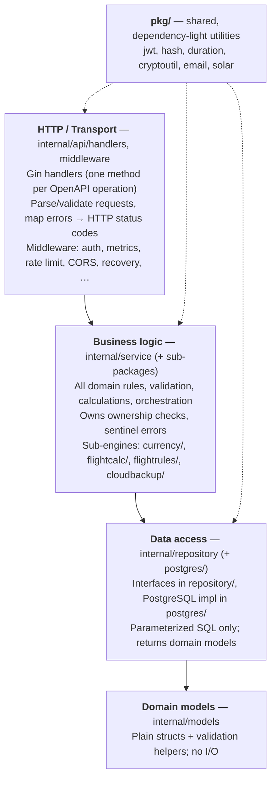
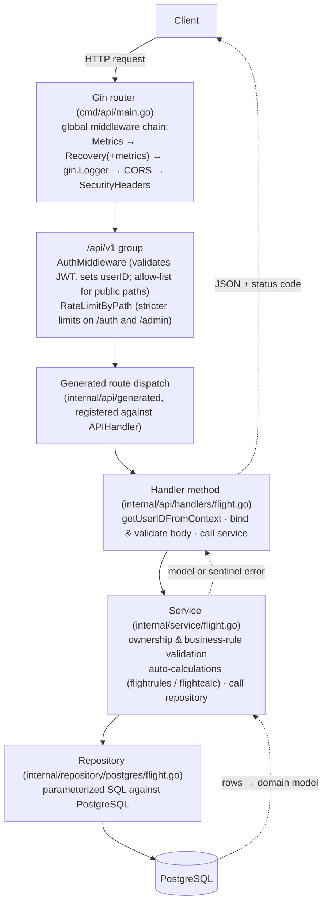
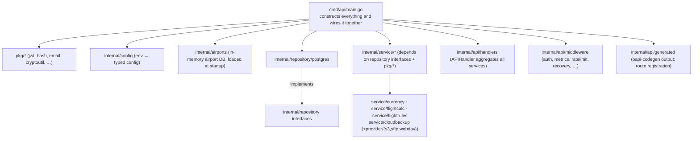

# Architecture

NinerLog API is a layered, dependency-injected Go service built on Gin. This document
explains the layers, how a request flows through them, how packages relate, and how the
application is wired together at startup.

## Layered architecture

The codebase follows a classic **handler → service → repository** layering. Each layer
depends only on the layer beneath it (and on `models`), which keeps business logic
testable and independent of HTTP and SQL details.

### Why these boundaries

- **Handlers never touch SQL.** They call services. This means transport concerns
  (status codes, JSON shapes) stay out of business logic.
- **Services never import Gin.** They take `context.Context` and plain arguments, so the
  same logic is reused by background jobs (notifications, backups) and by HTTP handlers.
- **Repositories are interfaces.** Services depend on the interfaces in
  `internal/repository`, not the PostgreSQL implementation in
  `internal/repository/postgres`. Tests substitute mocks/fakes.

## Request lifecycle

A typical authenticated request (e.g. `POST /api/v1/flights`) flows like this:

Errors propagate as **sentinel errors** from services (e.g. `ErrFlightNotFound`,
`ErrUnauthorizedFlight`). Handlers translate them into HTTP status codes; raw internal
errors are never returned to clients.

## Package relationships

`internal/api/handlers.APIHandler` is the aggregate struct that holds every service (and
a few repositories it needs directly, such as `FlightCrewRepository`). The generated
server interface is implemented by `APIHandler`, so each OpenAPI operation maps to a
method on it. See [API.md](./API.md).

## Application startup and wiring

All composition happens in `cmd/api/main.go`. The startup sequence is:

1. **Load config** from environment (`internal/config`).
2. **Open the database** and run migrations automatically via `golang-migrate`
   (`m.Up()`, ignoring `ErrNoChange`). Migration SQL lives in `db/migrations/`.
3. **Initialise the airport database** (`airports.Init()`) into memory.
4. **Construct repositories** (PostgreSQL implementations of the
   `internal/repository` interfaces).
5. **Construct services**, injecting repositories and `pkg` utilities
   (`NewAuthService`, `NewFlightService`, `NewLicenseService`, …).
6. **Build the currency engine**: create a registry and register evaluators
   (`EASA`, `FAA`, `Other`, and German UL via `RegisterMulti`), then wrap in
   `currency.NewService`.
7. **Construct optional subsystems** when their configuration is present:
   - **WebAuthn** service when `WEBAUTHN_RP_ID` is set.
   - **Cloud backup** scheduler when backup credentials key is configured; backup
     providers (`s3`, `sftp`, `webdav`) are registered into a provider registry.
8. **Aggregate services** into `handlers.APIHandler`.
9. **Build the Gin router**: install the global middleware chain, configure trusted
   proxies and forwarded-IP headers, set CORS, expose `/health` and (optionally)
   `/metrics`.
10. **Register routes**: the OpenAPI-generated routes under `/api/v1`, plus a few custom
    routes not in the spec (reports, flight utilities).
11. **Start background workers**: the notification background checker and (optionally)
    the backup scheduler, both bound to a cancellable context.
12. **Serve** with graceful shutdown that stops background workers.

### Optional / feature-flagged subsystems

| Subsystem | Enabled when | Notes |
| --- | --- | --- |
| Metrics (`/metrics`) | `METRICS_ENABLED` not disabled | Prometheus handler + DB-stats collector |
| WebAuthn / passkeys | `WEBAUTHN_RP_ID` set | Relying-party id/name/origins from env |
| Cloud backups | backup credentials key set | Registers S3/SFTP/WebDAV providers + scheduler |
| pprof profiling | `PPROF_ENABLED=true` | Debug profiling server |

## Cross-cutting concerns

- **Authentication & authorization** — JWT validated in `middleware.AuthMiddleware`; the
  authenticated `userID` is stored on the Gin context and read by handlers. Admin-only
  routes additionally check the admin middleware. See [AUTHENTICATION.md](./AUTHENTICATION.md).
- **Rate limiting** — `middleware.RateLimitByPath` applies stricter limits to `/auth` and
  `/admin` paths (backed by `ulule/limiter`).
- **Observability** — `middleware.MetricsMiddleware` records request metrics;
  `RecoveryWithMetrics` recovers panics and counts them. See [METRICS.md](./METRICS.md).
- **Security headers** — `middleware.SecurityHeadersMiddleware` sets HSTS, X-Frame-Options,
  etc.
- **Background jobs** — the notification checker and backup scheduler run as goroutines
  started in `main.go`, reusing the same services as the HTTP layer.

## Design principles

1. **OpenAPI-first.** The HTTP contract is defined in `api-spec/openapi.yaml`; Go server
   types and route registration are generated from it. Implement to the spec; never
   hand-edit generated code. See [API.md](./API.md).
2. **Dependency injection via constructors.** No global singletons for services; the
   exception is process-wide read-only data such as the airport database.
3. **Interfaces at the data boundary.** Services depend on repository interfaces, enabling
   unit testing without a database.
4. **Lossless time storage.** Durations are integer minutes everywhere; conversion is a
   display concern handled by `pkg/duration`.
5. **Pluggable engines.** Currency evaluators and backup providers are registered into
   registries, so adding a regulator or a storage backend is a localized change.
