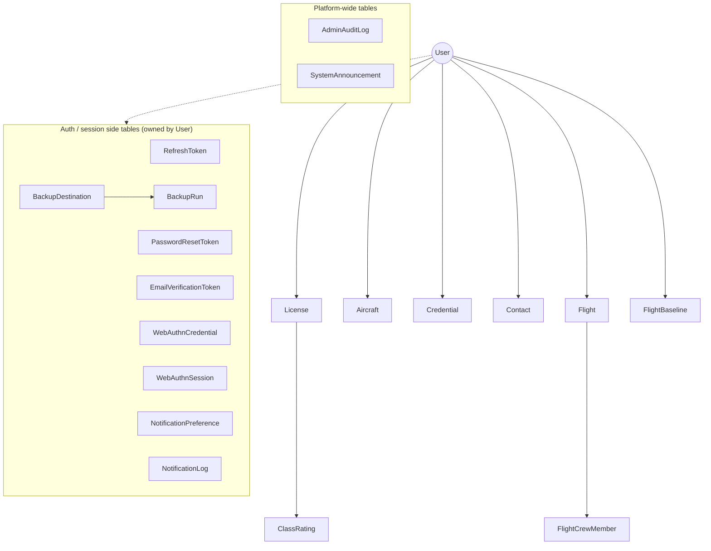

# Data Model

This document describes the domain entities, their relationships, and the database
schema strategy. The Go domain structs live in `internal/models`; the persisted schema
is defined by the ordered migrations in `db/migrations`.

## Entity relationship overview

Every user-owned entity is scoped by `user_id` and cascades on user deletion. Flights are
intentionally **not** linked to a specific license (they were detached in migration
`000018`) — currency is computed per class rating by aggregating all of a user's flights.

## Core entities

### User (`internal/models/user.go`, migrations 1, 11, 26, 28, 34, 35, 40)

The account holder. Notable fields:

- Identity: `Email`, `PasswordHash` (bcrypt; never serialized), `Name`.
- Verification & security: `EmailVerified`, `TwoFactorEnabled`, `TwoFactorSecret`,
  `RecoveryCodes`, `FailedLoginAttempts`, `LockedUntil`, `Disabled`, `LastLoginAt`.
- Display preferences: `TimeDisplayFormat` (`HH:MM` vs decimal hours), `DateFormat`,
  `DecimalSeparator`, `PreferredLocale` (drives localized emails — `en`/`de`).

Sensitive fields (`PasswordHash`, `TwoFactorSecret`, `RecoveryCodes`,
`FailedLoginAttempts`, `LockedUntil`) are tagged `json:"-"` so they never leak through the
API.

### License (`internal/models/license.go`, migrations 4, 17, 19)

A pilot license such as EASA PPL or FAA CPL. Key fields: `RegulatoryAuthority`
(e.g. `EASA`, `FAA`), `LicenseType`, `LicenseNumber`, `IssueDate`, `IssuingAuthority`,
`RequiresSeparateLogbook`. A user may hold several licenses.

### ClassRating (`internal/models/class_rating.go`, migration 20)

A class/type rating attached to a license. `ClassType` is an enum:

| Value | Meaning |
| --- | --- |
| `SEP_LAND` / `SEP_SEA` | Single-Engine Piston (land/sea) |
| `MEP_LAND` / `MEP_SEA` | Multi-Engine Piston (land/sea) |
| `SET_LAND` / `SET_SEA` | Single-Engine Turbine (land/sea) |
| `TMG` | Touring Motor Glider |
| `IR` | Instrument Rating |
| `OTHER` | Anything else |

`ExpiryDate` drives both notifications and the currency engine's expiry-anchored windows.

### Aircraft (`internal/models/aircraft.go`, migrations 12, 21, 22, 24, 36)

A user's aircraft: registration, type, make, model, and a class (e.g. `SEP_LAND`) that
links flights in that aircraft to the right currency bucket. Equipment flags capture
complex/high-performance/tailwheel characteristics.

### Credential (`internal/models/credential.go`, migration 9)

Non-license documents with expiry dates. `CredentialType` enum includes medicals
(`EASA_CLASS1_MEDICAL`, `FAA_CLASS3_MEDICAL`, `EASA_LAPL_MEDICAL`, …), language proficiency
(`LANG_ICAO_LEVEL4/5/6`), security clearances (`SEC_CLEARANCE_ZUP`, `SEC_CLEARANCE_ZUBB`),
and `OTHER`. These feed expiry notifications.

### Contact (`internal/models/contact.go`, migration 15)

Reusable people (instructors, fellow crew). Referenced by flights so names don't have to
be retyped; supports search.

### Flight (`internal/models/flight.go`, migrations 5–8, 14, 16, 23, 25, 30–32)

The central record. Highlights (all durations are **integer minutes**):

- **Identity / context**: `Date`, `AircraftReg`, `AircraftType`, `DepartureICAO`,
  `ArrivalICAO`, `Route` (comma-separated ICAO waypoints).
- **Block / event times** (`HH:MM:SS`, UTC): `OffBlockTime`, `OnBlockTime`,
  `DepartureTime`, `ArrivalTime`.
- **Function times** (minutes): `TotalTime`, `PICTime`, `DualTime`, `NightTime`,
  `IFRTime`, `SoloTime`, `CrossCountryTime`, `SICTime`, `DualGivenTime`,
  `SimulatedFlightTime`, `GroundTrainingTime`, `MultiPilotTime` (EASA AMC1 FCL.050 col 10),
  `ActualInstrumentTime`, `SimulatedInstrumentTime`.
- **Booleans**: `IsPIC`, `IsDual`.
- **Takeoffs/landings**: `LandingsDay`, `LandingsNight`, `AllLandings` (auto),
  `TakeoffsDay`, `TakeoffsNight` (auto from sunset/sunrise at departure).
- **Auto-calculated**: `SoloTime`, `CrossCountryTime`, `Distance` (NM, from airport
  coordinates). Each auto field has an `*Override` flag (not serialized) so a manual edit
  is preserved against re-calculation.
- **Instrument/IPC**: `Holds`, `ApproachesCount`, `Approaches` (structured
  `ApproachEntry{Type, Airport, Runway}` per FAA §61.51(g)(3)), `IsIPC`,
  `IsFlightReview`, `IsProficiencyCheck`.
- **Crew/instruction**: `PICName`, `InstructorName`, `InstructorComments`,
  `CrewMembers` (`FlightCrewMember`), `FSTDType`, `Endorsements`.
- **Gliders**: `LaunchMethod` (`winch`, `aerotow`, `self-launch`).
- **Free text**: `Remarks`.

Validation: `IsValid()` checks required fields; `ValidateTimeDistribution()` enforces
function-time consistency (see [DOMAIN.md](./DOMAIN.md#flight-validation)).

### FlightCrewMember (migration 15)

Associates contacts/named people with a flight in a specific role.

### FlightBaseline (`internal/models/flight_baseline.go`, migration 38)

Pre-existing totals carried over from a paper logbook or another system, so statistics
and totals reflect a pilot's full history without entering every historical flight.

## Auth, session, and notification tables

| Entity | Model | Migration | Purpose |
| --- | --- | --- | --- |
| RefreshToken | refresh token repo | 2 | Long-lived session tokens (stored hashed) |
| PasswordResetToken | — | 3 | Single-use password reset (1h) |
| EmailVerificationToken | — | 40 | Single-use email verification (24h) |
| WebAuthnCredential | `webauthn.go` | 37 | Registered passkeys (public key, sign count, transports) |
| WebAuthnSession | `webauthn.go` | 37 | Transient registration/login ceremony state |
| NotificationPreference | `notification.go` | 10, 33 | Per-category opt-in + warning windows |
| NotificationLog | `notification.go` | 10, 33 | Sent-notification history (dedup) |

Token-style tables store hashes, never raw secrets. See [AUTHENTICATION.md](./AUTHENTICATION.md).

## Cloud backup tables

| Entity | Model | Migration | Purpose |
| --- | --- | --- | --- |
| BackupDestination | `backup.go` | 39 | Provider config (S3/SFTP/WebDAV), schedule, retention; credentials AES-256-GCM encrypted |
| BackupRun | `backup.go` | 39 | History of backup attempts and outcomes |

See [FEATURES.md](./FEATURES.md#cloud-backups).

## Platform-wide tables

| Entity | Migration | Purpose |
| --- | --- | --- |
| AdminAuditLog | 27 | Records admin actions for accountability |
| SystemAnnouncement | 29 | Platform-wide banners shown to users |

## Schema & migration strategy

- Migrations are **ordered, paired** files (`NNNNNN_name.up.sql` / `.down.sql`) in
  `db/migrations/`, managed by [`golang-migrate`](https://github.com/golang-migrate/migrate).
- They are applied **automatically at application startup** (`m.Up()` in `cmd/api/main.go`,
  treating `ErrNoChange` as success). You can also run them manually via the Makefile
  targets (`make migrate-up`, `make migrate-down`, `make migrate-create`).
- **Never edit an applied migration.** Add a new migration to evolve the schema. The
  history is itself documentation of how the model evolved — e.g. migration 18 detached
  flights from licenses, migration 31 converted all time columns to integer minutes,
  migration 33 reworked the notification system into per-category preferences.

### Conventions

- Tables: `snake_case`, plural. Columns: `snake_case`. Booleans: `is_*`. Foreign keys:
  `{entity}_id`. Timestamps: `created_at` / `updated_at` (UTC).
- Primary keys are UUIDs.
- User-owned rows cascade-delete with the user.
- Durations are stored as `INTEGER` minutes (migration 31) — see
  [DOMAIN.md](./DOMAIN.md#time-and-duration-handling).
- Structured sub-data (e.g. flight approaches) is stored as JSON.

> When you add or change a migration, update this document and
> [DOMAIN.md](./DOMAIN.md) if the change affects domain rules.
