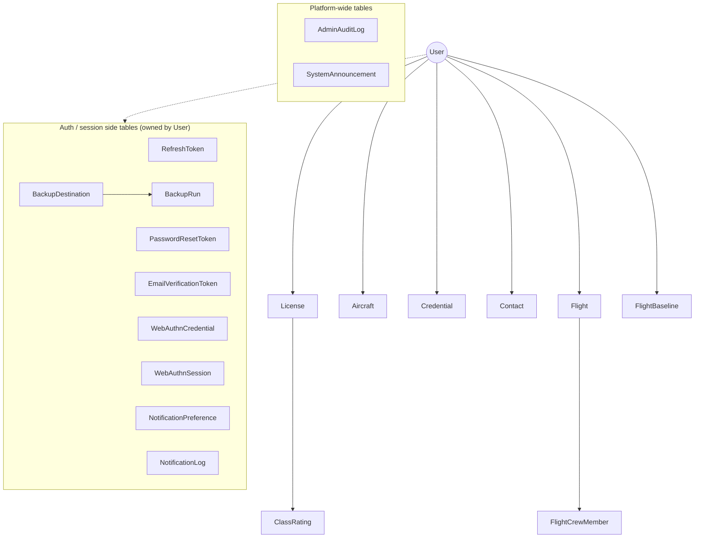

# Data Model

This document describes the domain entities, their relationships, and the database
schema strategy. The Go domain structs live in `internal/models`; the persisted schema
is defined by the ordered migrations in `db/migrations`.

## Entity relationship overview

Every user-owned entity is scoped by `user_id` and cascades on user deletion. Flights are
intentionally **not** linked to a specific license (they were detached in migration
`000018`) — currency is computed per class rating by aggregating all of a user's flights.

```mermaid
flowchart TD
    User((User))
    User --> License
    User --> Aircraft
    User --> Credential
    User --> Contact
    User --> Flight
    User --> FlightBaseline
    License --> ClassRating
    Flight --> FlightCrewMember

    subgraph auth["Auth / session side tables (owned by User)"]
        direction LR
        RefreshToken
        PasswordResetToken
        EmailVerificationToken
        WebAuthnCredential
        WebAuthnSession
        NotificationPreference
        NotificationLog
        BackupDestination --> BackupRun
    end

    subgraph platform["Platform-wide tables"]
        direction LR
        AdminAuditLog
        SystemAnnouncement
    end

    User -.-> auth
```

## Core entities

### User (`internal/models/user.go`, migrations 1, 11, 26, 28, 34, 35, 40, 45, 50)

The account holder. Notable fields:

- Identity: `Email`, `PasswordHash` (bcrypt; never serialized), `Name`.
- Verification & security: `EmailVerified`, `TwoFactorEnabled`, `TwoFactorSecret`,
  `RecoveryCodes`, `FailedLoginAttempts`, `LockedUntil`, `Disabled`, `LastLoginAt`.
  `LastLoginAt` is written by every path that issues a session — password login,
  the 2FA second factor, passkeys, OIDC, and the sign-up verification link — but
  not by a token refresh. See
  [AUTHENTICATION.md](AUTHENTICATION.md#login).
- Display preferences: `TimeDisplayFormat` (`HH:MM` vs decimal hours), `DateFormat`,
  `DecimalSeparator`, `PreferredLocale` (drives localized emails — `en`/`de`).
- Recency indicators: `RecencyPerModel`, `RecencyPerRegistration` — which informational
  90-day landing recency views the client shows.
- Flights-list columns: `FlightListColumnMode` (`auto` | `custom`) and
  `FlightListColumns`. In `auto` — the default, and what every existing account keeps —
  the client picks the optional columns from the flights on the page, so an unused column
  (IFR time for a VFR-only pilot) never takes up width. In `custom` the list is the
  user's own choice, and an empty list legitimately means "none of the optional columns",
  which is why the mode is a separate field rather than encoded as an empty list.
  `models.FlightListColumns` is the allowed vocabulary and the canonical display order;
  `NormalizeFlightListColumns` (applied in `AuthService.UpdateUser`) deduplicates,
  reorders and drops unknown keys, so the column never stores something the clients
  cannot render. The always-present columns — date, route, aircraft, total time — are
  deliberately not part of the vocabulary.

Sensitive fields (`PasswordHash`, `TwoFactorSecret`, `RecoveryCodes`,
`FailedLoginAttempts`, `LockedUntil`) are tagged `json:"-"` so they never leak through the
API.

### License (`internal/models/license.go`, migrations 4, 17, 19)

A pilot license such as EASA PPL or FAA CPL. Key fields: `RegulatoryAuthority`
(e.g. `EASA`, `FAA`), `LicenseType`, `LicenseNumber`, `IssueDate`, `IssuingAuthority`,
`RequiresSeparateLogbook`. A user may hold several licenses.

### ClassRating (`internal/models/class_rating.go`, migration 20)

A class/type rating attached to a license. `ClassType` is an enum:

| Value | Meaning |
| --- | --- |
| `SEP_LAND` / `SEP_SEA` | Single-Engine Piston (land/sea) |
| `MEP_LAND` / `MEP_SEA` | Multi-Engine Piston (land/sea) |
| `SET_LAND` / `SET_SEA` | Single-Engine Turbine (land/sea) |
| `TMG` | Touring Motor Glider |
| `IR` | Instrument Rating |
| `OTHER` | Anything else |

`ExpiryDate` drives both notifications and the currency engine's expiry-anchored windows.

### Aircraft (`internal/models/aircraft.go`, migrations 12, 21, 22, 24, 36)

A user's aircraft: registration, type, make, model, and a class (e.g. `SEP_LAND`) that
links flights in that aircraft to the right currency bucket. Equipment flags capture
complex/high-performance/tailwheel characteristics.

### Credential (`internal/models/credential.go`, migration 9)

Non-license documents with expiry dates. `CredentialType` enum includes medicals
(`EASA_CLASS1_MEDICAL`, `FAA_CLASS3_MEDICAL`, `EASA_LAPL_MEDICAL`, …), language proficiency
(`LANG_ICAO_LEVEL4/5/6`), security clearances (`SEC_CLEARANCE_ZUP`, `SEC_CLEARANCE_ZUBB`),
the German radio certificates (`RADIO_BZF2`, `RADIO_BZF1`, `RADIO_AZF` — three separate
certificates, not levels of one, and none of them expires), and `OTHER`. These feed expiry
notifications.

### DocumentImage (`internal/models/document_image.go`, migration 57)

Reference photos/scans attached to a licence **or** a credential — never both, never
neither (`document_images_one_subject`). Two nullable FKs rather than a polymorphic
`(subject_type, subject_id)` pair, so deleting the parent document cascades its images
away for real.

- `data BYTEA` holds the raw bytes. Postgres TOASTs the payload out of line, and every
  query except the single-image download uses an explicit column list that omits it, so a
  listing never reads it.
- Bounded by design: at most 5 MB (`byte_size` CHECK) and 5 images per document. The
  per-document cap is enforced by counting and inserting inside one transaction that first
  takes `SELECT … FOR UPDATE` on the owning licence/credential row, so concurrent uploads
  to the same document serialize on that row and cannot both take the last slot. Putting
  the count in the `INSERT`'s `WHERE` clause is *not* sufficient on its own: under READ
  COMMITTED the subquery reads the statement snapshot and takes no lock.
- `content_type` is restricted to `image/jpeg`/`image/png` and is derived from the stored
  bytes, not from what the uploader declared.
- Kept in Postgres rather than an object store because the self-hosted deployment has one
  database and no guaranteed blob backend; these inherit its backup/restore and cascade
  behaviour instead of needing a second story for identity-document scans.

The whole feature is switchable: `DOCUMENT_IMAGES_ENABLED=false` makes every image
endpoint answer 403 without touching the stored rows.

### Contact (`internal/models/contact.go`, migration 15)

Reusable people (instructors, fellow crew). Referenced by flights so names don't have to
be retyped; supports search.

### Flight (`internal/models/flight.go`, migrations 5–8, 14, 16, 23, 25, 30–32)

The central record. Highlights (all durations are **integer minutes**):

- **Identity / context**: `Date`, `AircraftReg`, `AircraftType`, `DepartureICAO`,
  `ArrivalICAO`, `Route` (comma-separated ICAO waypoints).
- **Block / event times** (`HH:MM:SS`, UTC): `OffBlockTime`, `OnBlockTime`,
  `DepartureTime`, `ArrivalTime`.
- **Function times** (minutes): `TotalTime`, `PICTime`, `DualTime`, `NightTime`,
  `IFRTime`, `SoloTime`, `CrossCountryTime`, `SICTime`, `DualGivenTime`,
  `SimulatedFlightTime`, `GroundTrainingTime`, `MultiPilotTime` (EASA AMC1 FCL.050 col 10),
  `ActualInstrumentTime`, `SimulatedInstrumentTime`.
- **Booleans**: `IsPIC`, `IsDual`.
- **Takeoffs/landings**: `LandingsDay`, `LandingsNight`, `AllLandings` (auto),
  `TakeoffsDay`, `TakeoffsNight` (auto from sunset/sunrise at departure).
- **Auto-calculated**: `SoloTime`, `CrossCountryTime`, `Distance` (NM, from airport
  coordinates). Each auto field has an `*Override` flag (not serialized) so a manual edit
  is preserved against re-calculation.
- **Instrument/IPC**: `Holds`, `ApproachesCount`, `Approaches` (structured
  `ApproachEntry{Type, Airport, Runway}` per FAA §61.51(g)(3)), `IsIPC`,
  `IsFlightReview`, `IsProficiencyCheck`.
- **Crew/instruction**: `PICName`, `InstructorName`, `InstructorComments`,
  `CrewMembers` (`FlightCrewMember`), `FSTDType`, `Endorsements`.
- **Gliders**: `LaunchMethod` (`winch`, `aerotow`, `self-launch`).
- **Free text**: `Remarks`.

Validation: `IsValid()` checks required fields; `ValidateTimeDistribution()` enforces
function-time consistency (see [DOMAIN.md](./DOMAIN.md#flight-validation)).

### FlightCrewMember (migration 15)

Associates contacts/named people with a flight in a specific role.

### FlightBaseline (`internal/models/flight_baseline.go`, migration 38)

Pre-existing totals carried over from a paper logbook or another system, so statistics
and totals reflect a pilot's full history without entering every historical flight.
Applied by `GET /users/me/statistics` and by the `totals` of `GET /reports/analytics`
whenever the requested range reaches back to the snapshot's cutoff date.

## Auth, session, and notification tables

| Entity | Model | Migration | Purpose |
| --- | --- | --- | --- |
| RefreshToken | refresh token repo | 2 | Long-lived session tokens (stored hashed) |
| PasswordResetToken | — | 3 | Single-use password reset (1h) |
| EmailVerificationToken | — | 40 | Single-use email verification (24h) |
| WebAuthnCredential | `webauthn.go` | 37 | Registered passkeys (public key, sign count, transports) |
| WebAuthnSession | `webauthn.go` | 37, 51 | Transient ceremony state, keyed by `sha256(handle)`; consumed exactly once via `DELETE … RETURNING` |
| OIDCIdentity | `oidc.go` | 52 | Links an external `(issuer, subject)` to a local user; only present in OIDC mode |
| OIDCLoginState | `oidc.go` | 52 | Pending authorization request — nonce and PKCE verifier, keyed by `sha256(state)` and bound to the originating browser by `sha256(cookie)` |
| OIDCHandoffCode | `oidc.go` | 52 | Single-use code bridging the provider redirect to the SPA's token request, keyed by `sha256(code)` |
| EmailDeliveryEvent | `email_delivery.go` | 56 | Append-only log of send attempts: recipient, message type, SMTP outcome and reply code. `user_id` is `ON DELETE SET NULL` so a bounce history outlives the account it belonged to |
| EmailSuppression | `email_delivery.go` | 56 | Addresses that refused mail permanently; keyed by lower-cased address. Consulted before every send |
| NotificationPreference | `notification.go` | 10, 33 | Per-category opt-in + warning windows |
| NotificationLog | `notification.go` | 10, 33 | Sent-notification history (dedup) |

Token-style tables store hashes, never raw secrets. See [AUTHENTICATION.md](./AUTHENTICATION.md)
and, for the OIDC tables, [OIDC.md](./OIDC.md).

`users.verification_reminder_sent_at` (migration 56) records when the follow-up
verification email went out. It is the clock the unverified-account reaper counts
from — not `created_at` — and is written and read only by the reaper's own
queries, which is why it has no field on `models.User`. A partial index
(`WHERE email_verified = FALSE`) keeps each sweep proportional to the number of
accounts stuck unverified rather than to the size of the users table. See the
lifecycle in [AUTHENTICATION.md](./AUTHENTICATION.md).

The three OIDC tables exist on every deployment but stay empty unless
`OIDC_ISSUER` is set. Accounts provisioned through OIDC are ordinary `users`
rows with an **empty** `password_hash`, which bcrypt can never match; every
foreign key elsewhere in the schema still points at `users(id)`.

## Cloud backup tables

| Entity | Model | Migration | Purpose |
| --- | --- | --- | --- |
| BackupDestination | `backup.go` | 39 | Provider config (S3/SFTP/WebDAV), schedule, retention; credentials AES-256-GCM encrypted |
| BackupRun | `backup.go` | 39 | History of backup attempts and outcomes |

See [FEATURES.md](./FEATURES.md#cloud-backups).

## Platform-wide tables

| Entity | Migration | Purpose |
| --- | --- | --- |
| AdminAuditLog | 27 | Records admin actions for accountability |
| SystemAnnouncement | 29 | Platform-wide banners shown to users |
| IdempotencyRecord (`idempotency.go`) | 52 | Replay records for mutating requests carrying an `Idempotency-Key`; see below |

`idempotency_keys` is keyed by `(user_id, idempotency_key)` and is deliberately
disposable — no UUID primary key, no `updated_at`, cascade-deleted with the user, and
swept once everything older than `IDEMPOTENCY_TTL` (24 h) has expired. A row is claimed
before its request runs (`state = 'in_progress'`) and finalized with the captured
response afterwards (`state = 'completed'`); `created_at` doubles as a fencing token, so
only the request that took a claim may finalize or release it. `request_hash` is a
SHA-256 over method, path+query and body, which is what lets one key reused for a
different payload be refused rather than silently answered. A completed row with a NULL
`response_status` means the response was too large to store — the write happened, so the
retry is refused rather than re-executed. See
[API.md](./API.md#idempotent-writes).

## Delta-sync indexes

Migration 53 adds `(user_id, updated_at DESC)` to `flights`, `aircraft`, `contacts`,
`credentials` and `licenses`. These back the `updatedSince` query parameter on the
corresponding list endpoints, which compiles to `AND updated_at > $n` alongside the
existing `user_id = $1` predicate — without the composite index every incremental pull
would scan the user's whole logbook, which is the cost the parameter exists to remove.
The leading `user_id` keeps the indexes usable for the plain user-scoped listing as well.
See [API.md](./API.md#delta-sync-updatedsince).

`updated_at` is maintained on all five tables: by the shared `update_updated_at_column()`
trigger on `flights`, `aircraft`, `credentials` and `licenses`, and by an explicit
assignment in the repository for `contacts`.

## Deletion tombstones

Migration 54 adds `deletion_tombstones` — `(user_id, entity_type, entity_id, deleted_at)`
— which is what `GET /sync/deletions` serves. `updatedSince` can only report records that
still exist, so without this a deleted flight is indistinguishable from one that never
changed.

Rows are written by an `AFTER DELETE` trigger (`record_deletion_tombstone()`) on
`flights`, `aircraft`, `contacts`, `credentials` and `licenses`, not by the repositories.
Deletions reach the database by several routes that never touch a repository — the raw SQL
in `DeleteAllUserData`, the admin user delete, and `ON DELETE CASCADE` — so a Go-side
implementation would have to be remembered at every one of them, now and in future. The
trigger also runs inside the deleting transaction, so a tombstone cannot go missing after a
delete the client was told succeeded.

The trigger deliberately skips rows whose owning user no longer exists. `DELETE FROM users`
removes the parent row before its cascade fires, so every cascaded child delete sees no
user — which is exactly when a tombstone is pointless (the account is gone; no client will
sync it again) and would otherwise strand rows referencing a deleted user.

A unique index on `(user_id, entity_type, entity_id)` keeps one tombstone per record; the
insert is an upsert, so deleting an id that was somehow recreated refreshes the stamp
rather than duplicating the entry. Reads are served by `(user_id, deleted_at, id)` — the
trailing `id` is what makes paging deterministic when a bulk delete stamps thousands of
rows with a single transaction timestamp.

Retention is bounded by `TOMBSTONE_RETENTION` (default 90 days) and swept hourly by
`DeletionService.StartReaper`. A client whose watermark predates the horizon is told so via
`watermarkExpired` rather than silently missing a delete. See
[API.md](./API.md#deletions-get-syncdeletions).

## Schema & migration strategy

- Migrations are **ordered, paired** files (`NNNNNN_name.up.sql` / `.down.sql`) in
  `db/migrations/`, managed by [`golang-migrate`](https://github.com/golang-migrate/migrate).
- They are applied **automatically at application startup** (`m.Up()` in `cmd/api/main.go`,
  treating `ErrNoChange` as success). You can also run them manually via the Makefile
  targets (`make migrate-up`, `make migrate-down`, `make migrate-create`).
- **Never edit an applied migration.** Add a new migration to evolve the schema. The
  history is itself documentation of how the model evolved — e.g. migration 18 detached
  flights from licenses, migration 31 converted all time columns to integer minutes,
  migration 33 reworked the notification system into per-category preferences.

### Conventions

- Tables: `snake_case`, plural. Columns: `snake_case`. Booleans: `is_*`. Foreign keys:
  `{entity}_id`. Timestamps: `created_at` / `updated_at` (UTC).
- Primary keys are UUIDs.
- User-owned rows cascade-delete with the user.
- Durations are stored as `INTEGER` minutes (migration 31) — see
  [DOMAIN.md](./DOMAIN.md#time-and-duration-handling).
- Structured sub-data (e.g. flight approaches) is stored as JSON.

> When you add or change a migration, update this document and
> [DOMAIN.md](./DOMAIN.md) if the change affects domain rules.
