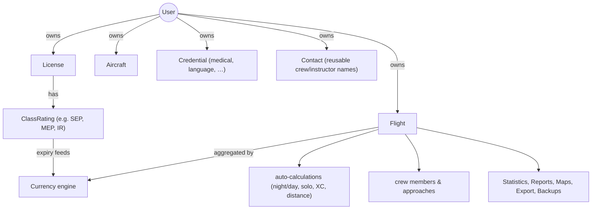

# NinerLog API — Developer Guide

This is the entry point for developers working on the **NinerLog API**, the backend
server for the NinerLog EASA/FAA-compliant digital pilot logbook. It is written for
any Go developer who needs to understand, extend, or maintain the system — no prior
knowledge of the project is assumed.

> **Keep this documentation accurate.** Every document under `docs/` is expected to
> reflect reality. When you change behaviour, update the corresponding document in the
> same pull request. See [Documentation Maintenance](#documentation-maintenance).

## What is NinerLog?

NinerLog is a free, open-source digital pilot logbook. Pilots record flights, manage
licenses/ratings/medical credentials, and the system computes regulatory **currency**
(am I legally allowed to fly / carry passengers?) against EASA and FAA rules. It also
provides statistics, reports, maps, import/export, encrypted cloud backups, and
expiry-reminder notifications.

This repository (`ninerlog-api`) is the **backend API**. The web client lives in the
separate `ninerlog-frontend` repository and consumes this API.

## Technology at a glance

| Concern | Choice |
| --- | --- |
| Language | Go (see `go.mod` for the exact toolchain version) |
| HTTP framework | [Gin](https://github.com/gin-gonic/gin) |
| Database | PostgreSQL (driver: `github.com/lib/pq`) |
| Migrations | [`golang-migrate`](https://github.com/golang-migrate/migrate), SQL files in `db/migrations/` |
| API contract | OpenAPI 3.1 (`api-spec/openapi.yaml`) → server stubs via `oapi-codegen` |
| Auth | JWT access + refresh tokens, TOTP 2FA, WebAuthn/passkeys |
| Crypto | `golang.org/x/crypto` (bcrypt), AES-256-GCM for stored credentials |
| Metrics | Prometheus (`prometheus/client_golang`) |
| Cloud backup | S3 (`minio-go`), SFTP (`pkg/sftp`), WebDAV (`gowebdav`) |
| PDF export | `go-pdf/fpdf` |
| Rate limiting | `ulule/limiter` |
| Testing | `testing` + `testify`, k6 for load tests |

## Documentation map

Read these in roughly this order:

1. **[ARCHITECTURE.md](./ARCHITECTURE.md)** — the layered architecture, request
   lifecycle, package relationships, and application startup/wiring.
2. **[DATA_MODEL.md](./DATA_MODEL.md)** — domain entities, their relationships, and the
   database schema / migration strategy.
3. **[DOMAIN.md](./DOMAIN.md)** — the aviation domain: flight logging, time handling,
   auto-calculations, validation rules, and the EASA/FAA **currency engine**.
4. **[API.md](./API.md)** — the HTTP API surface, the OpenAPI-first workflow, and how
   routes are registered and secured.
5. **[FEATURES.md](./FEATURES.md)** — a catalogue of every product feature and how it is
   implemented end-to-end.
6. **[PACKAGES.md](./PACKAGES.md)** — a reference for every package in `internal/` and
   `pkg/`.
7. **[DEVELOPMENT.md](./DEVELOPMENT.md)** — local setup, build, test, code generation,
   conventions, and the contribution workflow.

Topic-specific deep dives already in this repo:

- **[AUTHENTICATION.md](./AUTHENTICATION.md)** — token architecture, 2FA, WebAuthn,
  lockout, rate limiting.
- **[METRICS.md](./METRICS.md)** — Prometheus metrics and observability.
- **[PERFORMANCE.md](./PERFORMANCE.md)** — performance budgets, benchmarks, profiling.
- **[RUNNING_TESTS.md](./RUNNING_TESTS.md)** — how to run unit/integration/e2e tests.

## Core concepts and how they relate



- A **Flight** is the central record. Most other data exists to give flights meaning
  (which aircraft, under which license) or to derive insights from them (statistics,
  currency, reports).
- **Currency** is the regulatory heart of the product: it answers "is this pilot legally
  current?" by aggregating flights over rolling/expiry-anchored time windows per the
  authority (EASA, FAA, German UL, or a generic fallback). See
  [DOMAIN.md](./DOMAIN.md#currency-engine).
- All durations are stored as **integer minutes** to avoid floating-point rounding
  errors; helpers in `pkg/duration` convert to/from decimal hours and `HH:MM` for
  display. See [DOMAIN.md](./DOMAIN.md#time-and-duration-handling).

## Repository layout (top level)

```
api-spec/      OpenAPI 3.1 specification (single source of truth for the HTTP contract)
cmd/api/       main.go — application entry point and dependency wiring
db/migrations/ Ordered SQL migrations applied at startup via golang-migrate
docs/          This documentation
internal/      Private application code (handlers, services, repositories, models, ...)
pkg/           Reusable, dependency-light utility packages (jwt, hash, duration, ...)
scripts/       Build / codegen / test automation (bash)
test/          End-to-end (Go) and performance (k6) test suites
```

See [PACKAGES.md](./PACKAGES.md) for a full breakdown of `internal/` and `pkg/`.

## Documentation maintenance

This guide and its companion documents are part of the codebase and must stay truthful.
When you make a change, ask: *does any document under `docs/` now describe something
that is no longer true?* If so, update it in the same PR. The
[copilot-instructions](../.github/copilot-instructions.md#documentation-maintenance)
encode this as a hard rule for AI-assisted changes, but it applies to every contributor.
