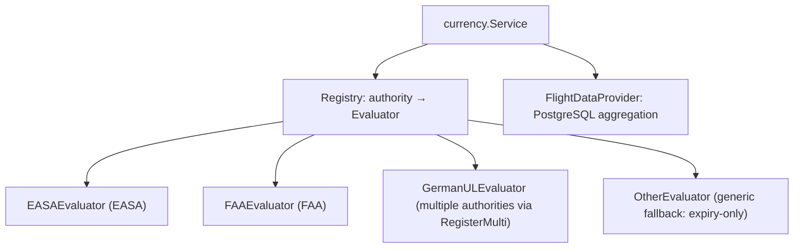

# Aviation Domain

This document explains the aviation-specific logic that makes NinerLog more than a CRUD
app: how flight time is represented, how fields are auto-calculated, how flights are
validated, and how the **currency engine** determines whether a pilot is legally current
under EASA, FAA, and other rule sets.

## Time and duration handling

All flight **durations are stored and manipulated as integer minutes** (migration
`000031` converted every time column from decimal hours to `INTEGER`). This eliminates
floating-point rounding errors (e.g. `1h23m` is exactly `83`, never `1.3833…`).

Conversion and formatting live in `pkg/duration`:

| Function | Purpose |
| --- | --- |
| `MinutesToDecimalHours(min) float64` | minutes → decimal hours (e.g. 83 → 1.38) |
| `DecimalHoursToMinutes(h) int` | decimal hours → minutes |
| `FormatHM(min) string` | `"1h 23m"` |
| `FormatColonHM(min) string` | `"1:23"` |
| `FormatDecimal(min) string` | decimal-hours string |
| `ParseDuration(input) (int, error)` | parse user input (`HH:MM`, decimal, etc.) → minutes |

Block/event times of day (`OffBlockTime`, `OnBlockTime`, `DepartureTime`, `ArrivalTime`)
are stored as `HH:MM:SS` strings in **UTC**, because they are wall-clock instants, not
durations. Per-user display preferences (`TimeDisplayFormat`, `DateFormat`,
`DecimalSeparator`) control how values are rendered for that pilot.

## Flight auto-calculations

When a flight is created or updated, the service derives several fields so pilots don't
have to compute them by hand. The entry point is
`flightcalc.ApplyAutoCalculations(flight, userName)`
(`internal/service/flightcalc/flightcalc.go`), which composes helpers from
`internal/service/flightrules`:

- **Day/night split** — `flightrules.IsNightAt(t, lat, lon)` uses
  sunrise/sunset (`pkg/solar`) at the relevant airport to classify takeoffs/landings as
  day or night, and to derive `NightTime`. The astronomical computation lives in
  `pkg/solar`.
- **Total landings** — `AllLandings = LandingsDay + LandingsNight`.
- **Solo time** — derived when the flight is neither dual nor flown as PIC with other
  crew.
- **Cross-country time** — derived when departure ≠ arrival airport.
- **Distance** — great-circle distance (nautical miles) from airport coordinates in the
  in-memory airport database (`internal/airports`).
- **Crew / roles / names / IFR / FSTD / remarks / display** — additional helpers in
  `flightrules/` (`crew.go`, `roles.go`, `names.go`, `ifr.go`, `fstd.go`, `remarks.go`,
  `display.go`) normalise crew roles, instructor/PIC names, instrument fields, simulator
  type, and display formatting.

### Manual overrides

Every auto-calculated takeoff/landing field has an `*Override` boolean (e.g.
`LandingsDayOverride`). When a pilot edits the value manually, the override flag is set so
recalculation does not clobber the manual entry. The `POST /flights/recalculate` endpoint
re-runs auto-calculations across a pilot's flights while respecting overrides.

## Flight validation

Validation is layered:

1. **Model-level** (`internal/models/flight.go`):
   - `IsValid()` — required fields present.
   - `ValidateTimeDistribution()` — function-time consistency, e.g. component times must
     not exceed total time and PIC/dual logic must be coherent.
2. **Text-field limits** (`internal/models/validation.go`) — enforces maximum lengths on
   free-text fields (registration, type, remarks, notes, …) to prevent abuse and oversized
   payloads.
3. **Service-level** (`internal/service/flight.go`) — ownership checks (the flight's
   aircraft/user belong to the caller) and orchestration of the above.

Validation failures surface as sentinel errors (e.g. `ErrInvalidFlight`,
`ErrInvalidTimeDistribution`) that handlers map to HTTP 400.

## Currency engine

**Currency** answers the regulator's question: *given recent flying, is this pilot
allowed to exercise the privileges of a rating, and to carry passengers?* It lives in
`internal/service/currency`.

### Design: registry of evaluators

`Service.EvaluateAll(ctx, userID)` walks the user's licenses and class ratings, looks up
the evaluator for each license's `RegulatoryAuthority`, and returns a
`CurrencyStatusResponse`. Each evaluator implements the `Evaluator` interface and may
additionally implement optional interfaces:

| Interface | Method | Regulatory basis |
| --- | --- | --- |
| `Evaluator` (required) | `Evaluate(...)` | Tier 1 — rating currency (can I fly this class at all?) |
| `PassengerCurrencyEvaluator` | `EvaluatePassengerCurrency(...)` | Tier 2 — passenger carriage (EASA FCL.060(b), FAA §61.57(a)/(b)) |
| `FlightReviewEvaluator` | `EvaluateFlightReview(...)` | FAA §61.56 flight review (24 calendar months) |

### Data provider

Evaluators never write SQL. They request aggregates through the `FlightDataProvider`
interface (`internal/service/currency/evaluator.go`), implemented for PostgreSQL in
`flight_data.go`:

- `GetProgressByAircraftClass(userID, classType, since)` — summed times/landings for a
  class since a date.
- `GetProgressAll(userID, since)` — same, across all classes.
- `GetLastFlightReview(userID)` — most recent `is_flight_review` flight.
- `GetLastProficiencyCheck(userID, classType, since)` — most recent proficiency check.
- `GetLaunchCounts(userID, since)` — per-launch-method counts for glider (SPL) currency.

This separation keeps the *regulatory* logic (what to count and over which window) in the
evaluators, and the *data* logic (how to query) in one place.

### Time windows and status

Evaluators compute over either a **rolling** window (e.g. last 90 days from now) or an
**expiry-anchored** window (counting toward a rating's `ExpiryDate`). The result for each
rating is a `Status` (`internal/service/currency/types.go`):

| Status | Meaning |
| --- | --- |
| `current` | Requirements met / not near expiry |
| `expiring` | Within the warning window before expiry |
| `expired` | Requirements not met / past expiry |
| `unknown` | Insufficient data to determine |

The response also carries human-readable requirement progress (e.g. "2 / 3 landings"),
so the UI can show exactly what remains.

### Regulatory differences (EASA vs FAA)

The two main rule sets differ substantially, which is why each has its own evaluator:

| Aspect | EASA (`easa.go`) | FAA (`faa.go`) |
| --- | --- | --- |
| Rating currency | Expiry-anchored (e.g. SEP class rating revalidation under FCL.740.A) | Privilege tied to flight review / proficiency, not a separate class-rating expiry |
| Passenger carriage | FCL.060(b): 3 takeoffs/landings; night requires 1 night landing unless IR held (FCL.060(b)(2)(ii)) | §61.57(a)/(b): 3 takeoffs/landings in 90 days (day); 3 full-stop night landings for night |
| Instrument recency | FCL.625.A revalidation | §61.57(c): rolling 6 months |
| Flight review | Recency requirements | §61.56: every 24 calendar months |
| Gliders | FCL.140.S — counts launches by method | §61.57(d) |

`GermanULEvaluator` handles German ultralight rules and registers itself for the relevant
authority strings via `RegisterMulti`. `OtherEvaluator` is the safe fallback for any
authority without a dedicated implementation — it performs an expiry-only check so the
system degrades gracefully rather than failing.

### Extending the engine

To support a new regulator:

1. Implement the `Evaluator` interface in a new file under
   `internal/service/currency` (and optionally `PassengerCurrencyEvaluator` /
   `FlightReviewEvaluator`).
2. Encode the rule's window type, thresholds, and messaging.
3. Register it in `cmd/api/main.go` (`currencyRegistry.Register(...)` or
   `RegisterMulti(...)`).
4. Add table-driven tests alongside the existing `*_test.go` files in the package.

No changes to handlers, the data provider, or the database are required for a new
authority that reuses existing aggregates.

## Where this connects

- Flights feed currency, statistics, reports, maps, and exports.
- Class-rating and credential expiry dates feed both the currency engine and the
  notification system (see [FEATURES.md](./FEATURES.md#notifications)).
- The HTTP surface for currency is `GET /currency` and `GET /licenses/{id}/currency`
  (see [API.md](./API.md)).

> When regulatory rules change, update the relevant evaluator **and** this document so
> the described behaviour stays accurate.
