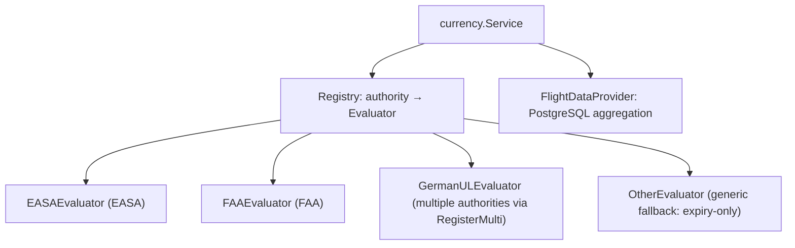

# Aviation Domain

This document explains the aviation-specific logic that makes NinerLog more than a CRUD
app: how flight time is represented, how fields are auto-calculated, how flights are
validated, and how the **currency engine** determines whether a pilot is legally current
under EASA, FAA, and other rule sets.

## Time and duration handling

All flight **durations are stored and manipulated as integer minutes** (migration
`000031` converted every time column from decimal hours to `INTEGER`). This eliminates
floating-point rounding errors (e.g. `1h23m` is exactly `83`, never `1.3833…`).

Conversion and formatting live in `pkg/duration`:

| Function | Purpose |
| --- | --- |
| `MinutesToDecimalHours(min) float64` | minutes → decimal hours (e.g. 83 → 1.38) |
| `DecimalHoursToMinutes(h) int` | decimal hours → minutes |
| `FormatHM(min) string` | `"1h 23m"` |
| `FormatColonHM(min) string` | `"1:23"` |
| `FormatDecimal(min) string` | decimal-hours string |
| `ParseDuration(input) (int, error)` | parse user input (`HH:MM`, decimal, etc.) → minutes |

Block/event times of day (`OffBlockTime`, `OnBlockTime`, `DepartureTime`, `ArrivalTime`)
are stored as `HH:MM:SS` strings in **UTC**, because they are wall-clock instants, not
durations. Per-user display preferences (`TimeDisplayFormat`, `DateFormat`,
`DecimalSeparator`) control how values are rendered for that pilot.

## Total time and pilot function time

`TotalTime` is **block time** — EASA AMC1 FCL.050 Col 9, "total time of flight". It is
computed by the server from `OffBlockTime` and `OnBlockTime`; clients do not send it.

The *pilot function time* columns (Cols 15–18) **decompose** that total rather than adding
to it:

| Column | Field | Counts toward total time |
| --- | --- | --- |
| PIC | `PICTime` | yes |
| PIC under supervision (PICUS) | `PICUSTime` | yes |
| Student PIC (SPIC) | `SPICTime` | yes |
| Co-pilot (SIC) | `SICTime` | yes |
| Dual received | `DualTime` | yes |
| Cruise relief co-pilot | `ReliefTime` | yes |
| Instructor (dual given) | `DualGivenTime` | no — it *overlays* the others |
| Examiner | `ExaminerTime` | no — it *overlays* the others |

So the invariant is
`PICTime + PICUSTime + SPICTime + SICTime + DualTime + ReliefTime <= TotalTime`, enforced
by `ValidateTimeDistribution()`. Two consequences are easy to get wrong:

- **Co-pilot time counts in full.** An airline first officer's 10-hour sector is 10 hours
  of total time, 10 hours of co-pilot time and zero PIC time, and all 10 count toward the
  1500 hours for an ATPL. Leaving `SICTime` out of the total would understate every
  multi-crew pilot's logbook.
- **Instructor time is not an extra slice.** An FI normally logs the same hour as both PIC
  and instructor time, so adding `DualGivenTime` to the sum would double-count it. It is
  bounded by `TotalTime` alone, not by `PICTime`, because an FI instructing a qualified
  pilot who acts as PIC logs instructor time with no PIC time of their own.

`SoloTime` and `CrossCountryTime` are likewise subsets of the total, not additional slices.

When a row declares `SICTime` but carries no crew list — typical of imported logbooks —
`flightrules.DetermineRole` resolves the user to co-pilot so `PICTime` is not also claimed
for the same minutes. Whether the time may be logged at all is a separate question, covered
next.

### Declared function times: PICUS, SPIC, examiner, relief

`PICUSTime` (PIC under supervision, EASA FCL.030 — the time a first officer logs toward
unfreezing an ATPL), `SPICTime` (student pilot-in-command on an integrated course),
`ExaminerTime` (conducting a check) and `ReliefTime` (cruise relief co-pilot on an
augmented crew) are **declared by the pilot and never auto-derived** — the server cannot
know that a sector was flown as pilot flying under supervision, or that the PIC
countersigned it. They are kept distinct from `PICTime` and `SICTime` in storage,
statistics and analytics, because a pilot needs "actual PIC" and "PICUS" as separate
totals.

Because PICUS, SPIC and relief are function times, derivation carves them out of the
derived column for the resolved role (`flightcalc.derivedFunctionMinutes`): a first
officer who declares a full sector as PICUS logs zero co-pilot time for it, and a partial
relief declaration leaves the remainder as co-pilot time. Examiner time overlays function
time exactly like `DualGivenTime` and is bounded by `TotalTime` alone. Declaring any of
the three carved times also declares the crew seat (`flightrules.HasDeclaredFunctionTime`
feeds `MayLogCoPilotTime` and `DetermineRole`), and any declared function time suppresses
solo time — each implies another pilot on board.

On the paper-layout exports (EASA/FAA CSV and PDF) the declared times fold into the
conventional columns — PICUS and SPIC into the PIC column per AMC1 FCL.050 (for FAA
layouts, into SIC and dual respectively per 14 CFR §61.51(f)), relief into the co-pilot
column — with the breakdown annotated in remarks by `flightrules.CombinedRemarks`
(`[PICUS 2:05]`). The standard CSV, JSON export and API keep the four as separate fields.

## Who may log co-pilot time

Co-pilot time is not a consequence of another pilot being on board. It requires a co-pilot
seat that the operation actually calls for, and most general aviation flying has none:

- a **multi-pilot aircraft** — certificated for a minimum crew of two pilots (EASA
  FCL.010; 14 CFR §61.51(f)(1), "aircraft type certificated for more than one pilot").
  This is `aircraft.is_multi_pilot`, a fleet fact alongside `is_complex`,
  `is_high_performance` and `is_tailwheel`. `aircraft_class` cannot express it: that
  column is free-form and describes engines and land/sea, not required crew;
- a **required safety pilot** during simulated instrument flight (14 CFR §91.109(b),
  loggable under §61.51(f)(2)) — the user carries the `SafetyPilot` crew role;
- a **declaration by the pilot** — the user lists their own `SIC` crew entry, or enters
  `sicTime` directly. Two-pilot operations mandated by an operations manual rather than by
  the type certificate (EASA FCL.010; §61.51(f)(2), §135.99(c)) are recorded this way.

`flightrules.MayLogCoPilotTime` is the single predicate. **An aircraft absent from the
fleet is treated as single-pilot**: derivation never invents co-pilot time for an aircraft
it knows nothing about.

### Passenger flights

When another person is pilot-in-command and none of the above applies, the user was
carried rather than crewed. `flightrules.DetermineRole` returns `RolePassenger` and the row
is stored with `is_passenger = true`: it keeps its route, block times and distance as the
record of the trip, and carries zero in `total_time` and every pilot-function, landing and
instrument column. Like an FSTD session it contributes to no total, statistic or currency
calculation — `flightrules.CountsAsFlightTime` and the SQL predicate
`NOT is_simulator AND NOT is_passenger` are the two sides of that rule.

### Declared versus derived co-pilot time

`SICTimeOverride` marks a co-pilot time the pilot entered, following the `*Override`
convention used for takeoffs and landings. Derivation trusts a declared value on any
aircraft and leaves it as entered; a value derivation wrote itself carries no override, so
re-running `POST /flights/recalculate` can still correct a row an earlier derivation filled
in. Without that distinction the derived value would justify itself on every subsequent
save.

### Multi-pilot time

The EASA AMC1 FCL.050 multi-pilot column (Col 10) records time flown in aeroplanes
certificated for a minimum crew of two, so `flightrules.IsMultiPilotOperation` requires
`is_multi_pilot` in addition to a two-pilot crew. A safety pilot in a single-pilot
aeroplane is a required crew member and logs co-pilot time, but the aeroplane stays
single-pilot and the time is not multi-pilot time. `PilotingCategoryFor` continues to bucket
a row as MP on `MultiPilotTime > 0`, which is now only ever filled for a multi-pilot
aircraft.

### Existing data

Migration `000065` does not infer `is_multi_pilot` from existing `multi_pilot_time`: that
would flag exactly the single-pilot aircraft this rule exists to correct, cementing the
error. The fleet starts unmarked and the pilot marks it.

What the migration does backfill is the two override flags, and only where derivation
cannot have produced the value. Before it, a co-pilot or multi-pilot time on a row with no
crew list was kept as entered — so it came from the pilot — while one on a row with a crew
list was written by derivation. Marking only the former as declared protects imported and
hand-entered logbooks from being re-derived on the next save, and leaves derived values
free to be corrected. Everything else stays as it is until the pilot marks their fleet and
runs `POST /flights/recalculate`.

## FSTD (simulator) sessions

A session in a flight simulation training device — FNPT, FTD, FFS, BATD/AATD — is training,
not flying. AMC1 FCL.050 records it in its own columns (20–22: date, device type, session
duration) and is explicit that **session time is recorded separately and may not be summed
with flight time**.

NinerLog stores a session as a `flights` row with `IsSimulator = true`. That row:

- carries its duration in `SimulatedFlightTime` and `FSTDType` for the device designation;
- has **zero** in every flight-time column — `TotalTime`, `PICTime`, `DualTime`, `SICTime`,
  `DualGivenTime`, `MultiPilotTime`, `PICUSTime`, `SPICTime`, `ExaminerTime`, `ReliefTime`,
  `SoloTime`, `CrossCountryTime`, `NightTime`, `IFRTime`
  — and zero landings, takeoffs and distance;
- has no `AircraftReg`, no departure/arrival and no block times. A device is not flown
  between places and has nothing to record off- and on-block, which is why those fields are
  required for a flight and rejected for a session. `AircraftType` is still required: it is
  the aircraft the device represents;
- **keeps** its instrument work — `SimulatedInstrumentTime` (capped at the session
  duration), `Holds`, `Approaches`, `IsIPC`, `IsProficiencyCheck` — because that is the
  training-relevant part. `ActualInstrumentTime` is cleared; actual instrument time
  requires real IMC.

`flightcalc.ApplyAutoCalculations` branches to `applySessionCalculations` for these rows, so
none of the flight-shaped derivations (night time, landing split, cross-country, distance,
PIC/dual from crew) run against them.

**Sessions are excluded from every aggregate.** `flightrules.CountsAsFlightTime` is the
Go-side predicate; in SQL the equivalent `NOT is_simulator` is carried by the statistics,
reports, analytics, per-aircraft and currency queries. This keeps a session out of flight
totals, the fleet list and — deliberately — the currency engine. FAA §61.57(c) does permit
instrument recency in an FSTD; crediting it is a separate change, and until then the
conservative answer is that a session never establishes currency.

In exports, sessions populate the FSTD block of the EASA layouts
(`flightrules.IsFSTDRow`, `FSTDFields`) and contribute 0 to the TOTAL TIME column, which is
what the paper form requires.

> Migration `000064` introduced `is_simulator` and backfilled it. Rows carrying an
> `fstd_type` were device sessions logged as flights with a placeholder registration and
> invented block times; the migration recovers the session duration into
> `simulated_flight_time` and clears their flight-time columns. Those values are not
> restored by the down migration.

## Flight auto-calculations

When a flight is created or updated, the service derives several fields so pilots don't
have to compute them by hand. The entry point is
`flightcalc.ApplyAutoCalculations(flight, userName, aircraft)`
(`internal/service/flightcalc/flightcalc.go`), which composes helpers from
`internal/service/flightrules`:

- **Day/night split** — `flightrules.IsNightAt(t, lat, lon)` uses
  sunrise/sunset (`pkg/solar`) at the relevant airport to classify takeoffs/landings as
  day or night, and to derive `NightTime`. The astronomical computation lives in
  `pkg/solar`.
- **Total landings** — `AllLandings = LandingsDay + LandingsNight`.
- **Solo time** — derived when the flight is neither dual nor flown as PIC with other
  crew.
- **Cross-country time** — derived when departure ≠ arrival airport.
- **Distance** — great-circle distance (nautical miles) from airport coordinates in the
  in-memory airport database (`internal/airports`).
- **Pilot role** — `flightrules.DetermineRole(flight, userName, aircraft)` resolves the
  user to PIC, dual received, dual given, co-pilot or passenger. `aircraft` is the fleet
  entry for the registration flown (`flightrules.AircraftFacts`), resolved by the caller
  via `service.AircraftFactsFor`; `nil` means the registration has no fleet entry. See
  [Who may log co-pilot time](#who-may-log-co-pilot-time).
- **Crew / roles / names / IFR / FSTD / remarks / display** — additional helpers in
  `flightrules/` (`crew.go`, `roles.go`, `names.go`, `ifr.go`, `fstd.go`, `remarks.go`,
  `display.go`) normalise crew roles, instructor/PIC names, instrument fields, simulator
  type, and display formatting.

### Manual overrides

Every auto-calculated takeoff/landing field has an `*Override` boolean (e.g.
`LandingsDayOverride`), as do `SICTime` and `MultiPilotTime`. When a pilot edits the value
manually, the override flag is set so recalculation does not clobber the manual entry. The
`POST /flights/recalculate` endpoint re-runs auto-calculations across a pilot's flights
while respecting overrides. The flags are not serialised: the handlers set them when the
request carries the corresponding field.

## Flight validation

Validation is layered:

1. **Model-level** (`internal/models/flight.go`):
   - `IsValid()` — required fields present. These differ by row kind: a flight needs a
     registration and block time, a session needs `FSTDType` and a positive
     `SimulatedFlightTime` (see [FSTD sessions](#fstd-simulator-sessions)), and a
     passenger flight needs only a registration.
   - `ValidateTimeDistribution()` — function-time consistency: component times must not
     exceed total time,
     `PICTime + PICUSTime + SPICTime + SICTime + DualTime + ReliefTime <= TotalTime`
     (instructor and examiner time overlay instead), PIC/dual logic must be coherent, and
     a session or passenger flight must carry no flight time at all.
2. **Text-field limits** (`internal/models/validation.go`) — enforces maximum lengths on
   free-text fields (registration, type, remarks, notes, …) to prevent abuse and oversized
   payloads.
3. **Service-level** (`internal/service/flight.go`) — ownership checks (the flight's
   aircraft/user belong to the caller) and orchestration of the above.

Validation failures surface as sentinel errors (e.g. `ErrInvalidFlight`,
`ErrInvalidTimeDistribution`) that handlers map to HTTP 400.

## Aircraft registration normalisation

`AircraftService.CreateAircraft`/`UpdateAircraft` and `FlightService.CreateFlight`/
`UpdateFlight` canonicalise `Registration`/`AircraftReg` through `pkg/registration` before
validating: a nationality mark recognised against the vendored ICAO table gets its hyphen
inserted, moved or removed to match how that state writes it (`DEABC` → `D-EABC`,
`N-12345` → `N12345`); anything unrecognised is only uppercased and trimmed. This matters
because `flights.aircraft_reg` is a denormalised string and the join key the fleet and
per-registration statistics group by — two spellings of one aircraft otherwise split into
two fleet entries and two sets of statistics. Full design, the table-maintenance workflow,
and the `POST /flights/recalculate` migration path are in
[AIRCRAFT_REGISTRATIONS.md](./AIRCRAFT_REGISTRATIONS.md).

## Currency engine

**Currency** answers the regulator's question: *given recent flying, is this pilot
allowed to exercise the privileges of a rating, and to carry passengers?* It lives in
`internal/service/currency`.

### Design: registry of evaluators

```mermaid
flowchart TD
    SVC[currency.Service]
    SVC --> REG[Registry: authority → Evaluator]
    SVC --> FDP[FlightDataProvider: PostgreSQL aggregation]
    REG --> EASA["EASAEvaluator (EASA)"]
    REG --> FAA["FAAEvaluator (FAA)"]
    REG --> GUL["GermanULEvaluator (multiple authorities via RegisterMulti)"]
    REG --> OTH["OtherEvaluator (generic fallback: expiry-only)"]
```

`Service.EvaluateAll(ctx, userID)` walks the user's licenses and class ratings, looks up
the evaluator for each license's `RegulatoryAuthority`, and returns a
`CurrencyStatusResponse`. Each evaluator implements the `Evaluator` interface and may
additionally implement optional interfaces:

| Interface | Method | Regulatory basis |
| --- | --- | --- |
| `Evaluator` (required) | `Evaluate(...)` | Tier 1 — rating currency (can I fly this class at all?) |
| `PassengerCurrencyEvaluator` | `EvaluatePassengerCurrency(...)` | Tier 2 — passenger carriage (EASA FCL.060(b), FAA §61.57(a)/(b)) |
| `FlightReviewEvaluator` | `EvaluateFlightReview(...)` | FAA §61.56 flight review (24 calendar months) |

### Data provider

Evaluators never write SQL. They request aggregates through the `FlightDataProvider`
interface (`internal/service/currency/evaluator.go`), implemented for PostgreSQL in
`internal/repository/postgres/currency_flight_data.go`:

- `GetProgressByAircraftClass(userID, classType, since)` — summed times/landings for a
  class since a date.
- `GetProgressAll(userID, since)` — same, across all classes.
- `GetLastFlightReview(userID)` — most recent `is_flight_review` flight.
- `GetLastProficiencyCheck(userID, classType, since)` — most recent proficiency check.
- `GetLaunchCounts(userID, since)` — per-launch-method counts for glider (SPL) currency.

This separation keeps the *regulatory* logic (what to count and over which window) in the
evaluators, and the *data* logic (how to query) in one place.

### Time windows and status

Evaluators compute over either a **rolling** window (e.g. last 90 days from now) or an
**expiry-anchored** window (counting toward a rating's `ExpiryDate`). The result for each
rating is a `Status` (`internal/service/currency/types.go`):

| Status | Meaning |
| --- | --- |
| `current` | Requirements met / not near expiry |
| `expiring` | Within the warning window before expiry |
| `expired` | Requirements not met / past expiry |
| `unknown` | Insufficient data to determine |

The response also carries human-readable requirement progress (e.g. "2 / 3 landings"),
so the UI can show exactly what remains.

### Regulatory differences (EASA vs FAA)

The two main rule sets differ substantially, which is why each has its own evaluator:

| Aspect | EASA (`easa.go`) | FAA (`faa.go`) |
| --- | --- | --- |
| Rating currency | Expiry-anchored (e.g. SEP class rating revalidation under FCL.740.A) | Privilege tied to flight review / proficiency, not a separate class-rating expiry |
| Passenger carriage | FCL.060(b): 3 takeoffs/landings; night requires 1 night landing unless IR held (FCL.060(b)(2)(ii)) | §61.57(a)/(b): 3 takeoffs/landings in 90 days (day); 3 full-stop night landings for night |
| Instrument recency | FCL.625.A revalidation | §61.57(c): rolling 6 months |
| Flight review | Recency requirements | §61.56: every 24 calendar months |
| Gliders | FCL.140.S — counts launches by method | §61.57(d) |

`GermanULEvaluator` handles German ultralight rules and registers itself for the relevant
authority strings via `RegisterMulti`. `OtherEvaluator` is the safe fallback for any
authority without a dedicated implementation — it performs an expiry-only check so the
system degrades gracefully rather than failing.

### Extending the engine

To support a new regulator:

1. Implement the `Evaluator` interface in a new file under
   `internal/service/currency` (and optionally `PassengerCurrencyEvaluator` /
   `FlightReviewEvaluator`).
2. Encode the rule's window type, thresholds, and messaging.
3. Register it in `cmd/api/main.go` (`currencyRegistry.Register(...)` or
   `RegisterMulti(...)`).
4. Add table-driven tests alongside the existing `*_test.go` files in the package.

No changes to handlers, the data provider, or the database are required for a new
authority that reuses existing aggregates.

## Where this connects

- Flights feed currency, statistics, reports, maps, and exports.
- Class-rating and credential expiry dates feed both the currency engine and the
  notification system (see [FEATURES.md](./FEATURES.md#notifications)).
- The HTTP surface for currency is `GET /currency` and `GET /licenses/{id}/currency`
  (see [API.md](./API.md)).

> When regulatory rules change, update the relevant evaluator **and** this document so
> the described behaviour stays accurate.
