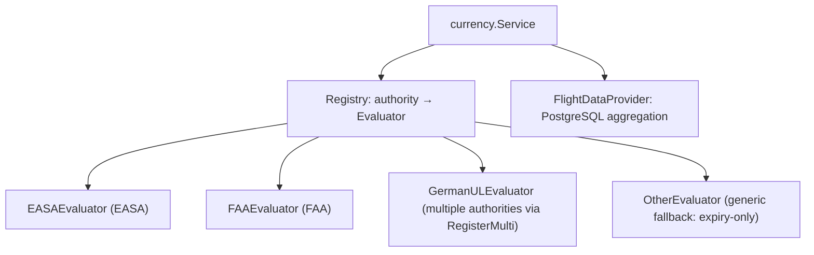

# Aviation Domain

This document explains the aviation-specific logic that makes NinerLog more than a CRUD
app: how flight time is represented, how fields are auto-calculated, how flights are
validated, and how the **currency engine** determines whether a pilot is legally current
under EASA, FAA, and other rule sets.

## Time and duration handling

All flight **durations are stored and manipulated as integer minutes** (migration
`000031` converted every time column from decimal hours to `INTEGER`). This eliminates
floating-point rounding errors (e.g. `1h23m` is exactly `83`, never `1.3833…`).

Conversion and formatting live in `pkg/duration`:

| Function | Purpose |
| --- | --- |
| `MinutesToDecimalHours(min) float64` | minutes → decimal hours (e.g. 83 → 1.38) |
| `DecimalHoursToMinutes(h) int` | decimal hours → minutes |
| `FormatHM(min) string` | `"1h 23m"` |
| `FormatColonHM(min) string` | `"1:23"` |
| `FormatDecimal(min) string` | decimal-hours string |
| `ParseDuration(input) (int, error)` | parse user input (`HH:MM`, decimal, etc.) → minutes |

Block/event times of day (`OffBlockTime`, `OnBlockTime`, `DepartureTime`, `ArrivalTime`)
are stored as `HH:MM:SS` strings in **UTC**, because they are wall-clock instants, not
durations. Per-user display preferences (`TimeDisplayFormat`, `DateFormat`,
`ClockFormat`, `DecimalSeparator`) control how values are rendered for that pilot;
`ClockFormat` affects display only — stored and exported times stay 24-hour.

## Total time and pilot function time

`TotalTime` is the **total time of flight** — EASA AMC1 FCL.050 Col 9. It is computed by
the server; clients do not send it. A flight carries at least one complete pair of clock
times, and the pair decides the total:

| Pair present | `TotalTime` |
| --- | --- |
| `OffBlockTime` + `OnBlockTime` (with or without take-off/landing) | off-block to on-block |
| `DepartureTime` (take-off) + `ArrivalTime` (landing) only | take-off to landing |

A span whose end is earlier than its start crosses midnight UTC; identical start and end
are rejected. `POST /flights` rejects a flight with no complete pair, and a lone half of a
pair (only `OffBlockTime`, only `DepartureTime`, …) with no complete pair beside it. FSTD
sessions keep their own rules and carry none of these times.

The rule lives in `models.FlightClocks` (`internal/models/flight_times.go`): `Pair()`
picks the pair, `Validate()` applies the rejection rules, `TotalMinutes()` computes the
span. Everything that reads times goes through it:

- night time is computed over the same pair (`calculateNightTime`);
- a take-off is classified day or night at `TakeoffClock()` — off-block, else take-off —
  and a landing at `LandingClock()` — on-block, else landing;
- a flight saved with `TotalTime` 0 (import, recalculation) recovers it from the pair;
- the EASA CSV, EASA PDF and vsimakhin/web-logbook exports print `LogbookClocks()` in
  their departure/arrival time columns: the block pair, else take-off and landing.
  AMC1 FCL.050 asks for departure and arrival times, which for a sailplane are take-off
  and landing;
- a CSV import takes the block span, else the file's total-time column, else take-off to
  landing (import keeps accepting rows with a lone half or no times at all when a
  total-time column supplies the total);
- tap-to-log: a `takeoff` event with no open session opens one, and its `landing`
  completes it as a take-off/landing-only flight; a session opened at off-block still
  completes at on-block.

Block times keep precedence everywhere they are present, so a flight logged with block
times derives exactly what it did before take-off/landing-only flights were accepted.

The *pilot function time* columns (Cols 15–18) **decompose** that total rather than adding
to it:

| Column | Field | Counts toward total time |
| --- | --- | --- |
| PIC | `PICTime` | yes |
| PIC under supervision (PICUS) | `PICUSTime` | yes |
| Student PIC (SPIC) | `SPICTime` | yes |
| Co-pilot (SIC) | `SICTime` | yes |
| Dual received | `DualTime` | yes |
| Cruise relief co-pilot | `ReliefTime` | yes |
| Instructor (dual given) | `DualGivenTime` | no — it *overlays* the others |
| Examiner | `ExaminerTime` | no — it *overlays* the others |

So the invariant is
`PICTime + PICUSTime + SPICTime + SICTime + DualTime + ReliefTime <= TotalTime`, enforced
by `ValidateTimeDistribution()`. Two consequences are easy to get wrong:

- **Co-pilot time counts in full.** An airline first officer's 10-hour sector is 10 hours
  of total time, 10 hours of co-pilot time and zero PIC time, and all 10 count toward the
  1500 hours for an ATPL. Leaving `SICTime` out of the total would understate every
  multi-crew pilot's logbook.
- **Instructor time is not an extra slice.** An FI normally logs the same hour as both PIC
  and instructor time, so adding `DualGivenTime` to the sum would double-count it. It is
  bounded by `TotalTime` alone, not by `PICTime`, because an FI instructing a qualified
  pilot who acts as PIC logs instructor time with no PIC time of their own.

`SoloTime` and `CrossCountryTime` are likewise subsets of the total, not additional slices.

When a row declares `SICTime` but carries no crew list — typical of imported logbooks —
`flightrules.DetermineRole` resolves the user to co-pilot so `PICTime` is not also claimed
for the same minutes. Whether the time may be logged at all is a separate question, covered
next.

### Declared function times: PICUS, SPIC, examiner, relief

`PICUSTime` (PIC under supervision, EASA FCL.030 — the time a first officer logs toward
unfreezing an ATPL), `SPICTime` (student pilot-in-command on an integrated course, or a
student glider pilot's solo flight under the supervision of an FI(S), which Part-SFCL
counts toward the SFCL.160 hours; see [SAILPLANES.md](./SAILPLANES.md#supervised-solo)),
`ExaminerTime` (conducting a check) and `ReliefTime` (cruise relief co-pilot on an
augmented crew) are **declared by the pilot and never auto-derived** — the server cannot
know that a sector was flown as pilot flying under supervision, or that the PIC
countersigned it. They are kept distinct from `PICTime` and `SICTime` in storage,
statistics and analytics, because a pilot needs "actual PIC" and "PICUS" as separate
totals.

Because PICUS, SPIC and relief are function times, derivation carves them out of the
derived column for the resolved role (`flightcalc.derivedFunctionMinutes`): a first
officer who declares a full sector as PICUS logs zero co-pilot time for it, and a partial
relief declaration leaves the remainder as co-pilot time. Examiner time overlays function
time exactly like `DualGivenTime` and is bounded by `TotalTime` alone. Declaring any of
the three carved times also declares the crew seat (`flightrules.HasDeclaredFunctionTime`
feeds `MayLogCoPilotTime` and `DetermineRole`), and any declared function time suppresses
solo time — each implies another pilot on board.

On the paper-layout exports (EASA/FAA CSV and PDF) the declared times fold into the
conventional columns — PICUS and SPIC into the PIC column per AMC1 FCL.050 (for FAA
layouts, into SIC and dual respectively per 14 CFR §61.51(f)), relief into the co-pilot
column — with the breakdown annotated in remarks by `flightrules.CombinedRemarks`
(`[PICUS 2:05]`). The standard CSV, JSON export and API keep the four as separate fields.

## Who may log co-pilot time

Co-pilot time is not a consequence of another pilot being on board. It requires a co-pilot
seat that the operation actually calls for, and most general aviation flying has none:

- a **multi-pilot aircraft** — certificated for a minimum crew of two pilots (EASA
  FCL.010; 14 CFR §61.51(f)(1), "aircraft type certificated for more than one pilot").
  This is `aircraft.is_multi_pilot`, a fleet fact alongside `is_complex`,
  `is_high_performance` and `is_tailwheel`. `aircraft_class` cannot express it: that
  column is free-form and describes engines and land/sea, not required crew;
- a **required safety pilot** during simulated instrument flight (14 CFR §91.109(b),
  loggable under §61.51(f)(2)) — the user carries the `SafetyPilot` crew role;
- a **declaration by the pilot** — the user lists their own `SIC` crew entry, or enters
  `sicTime` directly. Two-pilot operations mandated by an operations manual rather than by
  the type certificate (EASA FCL.010; §61.51(f)(2), §135.99(c)) are recorded this way.

`flightrules.MayLogCoPilotTime` is the single predicate. **An aircraft absent from the
fleet is treated as single-pilot**: derivation never invents co-pilot time for an aircraft
it knows nothing about.

### Passenger flights

When another person is pilot-in-command and none of the above applies, the user was
carried rather than crewed. `flightrules.DetermineRole` returns `RolePassenger` and the row
is stored with `is_passenger = true`: it keeps its route, block times and distance as the
record of the trip, and carries zero in `total_time` and every pilot-function, landing and
instrument column. Like an FSTD session it contributes to no total, statistic or currency
calculation — `flightrules.CountsAsFlightTime` and the SQL predicate
`NOT is_simulator AND NOT is_passenger` are the two sides of that rule.

### Declared versus derived co-pilot time

`SICTimeOverride` marks a co-pilot time the pilot entered, following the `*Override`
convention used for takeoffs and landings. Derivation trusts a declared value on any
aircraft and leaves it as entered; a value derivation wrote itself carries no override, so
re-running `POST /flights/recalculate` can still correct a row an earlier derivation filled
in. Without that distinction the derived value would justify itself on every subsequent
save.

### Multi-pilot time

The EASA AMC1 FCL.050 multi-pilot column (Col 10) records time flown in aeroplanes
certificated for a minimum crew of two, so `flightrules.IsMultiPilotOperation` requires
`is_multi_pilot` in addition to a two-pilot crew. A safety pilot in a single-pilot
aeroplane is a required crew member and logs co-pilot time, but the aeroplane stays
single-pilot and the time is not multi-pilot time. `PilotingCategoryFor` continues to bucket
a row as MP on `MultiPilotTime > 0`, which is now only ever filled for a multi-pilot
aircraft.

### Existing data

Migration `000065` does not infer `is_multi_pilot` from existing `multi_pilot_time`: that
would flag exactly the single-pilot aircraft this rule exists to correct, cementing the
error. The fleet starts unmarked and the pilot marks it.

What the migration does backfill is the two override flags, and only where derivation
cannot have produced the value. Before it, a co-pilot or multi-pilot time on a row with no
crew list was kept as entered — so it came from the pilot — while one on a row with a crew
list was written by derivation. Marking only the former as declared protects imported and
hand-entered logbooks from being re-derived on the next save, and leaves derived values
free to be corrected. Everything else stays as it is until the pilot marks their fleet and
runs `POST /flights/recalculate`.

## FSTD (simulator) sessions

A session in a flight simulation training device — FNPT, FTD, FFS, BATD/AATD — is training,
not flying. AMC1 FCL.050 records it in its own columns (20–22: date, device type, session
duration) and is explicit that **session time is recorded separately and may not be summed
with flight time**.

NinerLog stores a session as a `flights` row with `IsSimulator = true`. That row:

- carries its duration in `SimulatedFlightTime` and `FSTDType` for the device designation;
- has **zero** in every flight-time column — `TotalTime`, `PICTime`, `DualTime`, `SICTime`,
  `DualGivenTime`, `MultiPilotTime`, `PICUSTime`, `SPICTime`, `ExaminerTime`, `ReliefTime`,
  `SoloTime`, `CrossCountryTime`, `NightTime`, `IFRTime`
  — and zero landings, takeoffs and distance;
- has no `AircraftReg`, no departure/arrival and no block times. A device is not flown
  between places and has nothing to record off- and on-block, which is why those fields are
  required for a flight and rejected for a session. `AircraftType` is still required: it is
  the aircraft the device represents;
- **keeps** its instrument work — `SimulatedInstrumentTime` (capped at the session
  duration), `Holds`, `Approaches`, `IsIPC`, `IsProficiencyCheck` — because that is the
  training-relevant part. `ActualInstrumentTime` is cleared; actual instrument time
  requires real IMC.

`flightcalc.ApplyAutoCalculations` branches to `applySessionCalculations` for these rows, so
none of the flight-shaped derivations (night time, landing split, cross-country, distance,
PIC/dual from crew) run against them.

**Sessions are excluded from every aggregate.** `flightrules.CountsAsFlightTime` is the
Go-side predicate; in SQL the equivalent `NOT is_simulator` is carried by the statistics,
reports, analytics, per-aircraft and currency queries. This keeps a session out of flight
totals, the fleet list and — deliberately — the currency engine. FAA §61.57(c) does permit
instrument recency in an FSTD; crediting it is a separate change, and until then the
conservative answer is that a session never establishes currency.

Custom reports (`/reports/custom`) select flights with the same filter as `GET /flights`,
then apply this rule in the aggregate: every duration metric and `flights`/`landings` count
only rows where
`NOT is_simulator AND NOT is_passenger`. The one exception is `fstdTime`, which sums
`simulated_flight_time` across the matching simulator rows on its own — so a report can
show flight hours and FSTD hours side by side without summing them, matching AMC1 FCL.050.

In exports, sessions populate the FSTD block of the EASA layouts
(`flightrules.IsFSTDRow`, `FSTDFields`) and contribute 0 to the TOTAL TIME column, which is
what the paper form requires.

> Migration `000064` introduced `is_simulator` and backfilled it. Rows carrying an
> `fstd_type` were device sessions logged as flights with a placeholder registration and
> invented block times; the migration recovers the session duration into
> `simulated_flight_time` and clears their flight-time columns. Those values are not
> restored by the down migration.

## Flight auto-calculations

When a flight is created or updated, the service derives several fields so pilots don't
have to compute them by hand. The entry point is
`flightcalc.ApplyAutoCalculations(flight, userName, aircraft)`
(`internal/service/flightcalc/flightcalc.go`), which composes helpers from
`internal/service/flightrules`:

- **Day/night split** — `flightrules.IsNightAt(t, lat, lon)` uses
  sunrise/sunset (`pkg/solar`) at the relevant airport to classify takeoffs/landings as
  day or night, and to derive `NightTime`. The astronomical computation lives in
  `pkg/solar`.
- **Total landings** — `AllLandings = LandingsDay + LandingsNight`.
- **Takeoffs** — one takeoff per landing: `TakeoffsDay + TakeoffsNight = AllLandings`,
  all classified day or night by the off-block time (else the take-off time) at the
  departure airport (day when the departure or both times are missing or unknown). Re-derived from the landing count on
  every save, so a stored value is never reused.
- **Launches** — `Launches` is the take-off count (day + night), at least one per flight,
  unless `LaunchesOverride` is set; an FSTD session or a passenger flight has none
  (`Flight.DeriveLaunches`, run by `ApplyAutoCalculations` and again by the service on
  every create and update, so a JSON restore without the field derives it too). A pilot
  logging a series of launches as one row sets the count; see
  [SAILPLANES.md](./SAILPLANES.md#launches-and-series-entries). Rows stored before the
  column existed hold `NULL` and read as the take-off count, at least one.
- **Solo time** — derived when the flight is neither dual nor flown as PIC with other
  crew.
- **Cross-country time** — derived as the whole total time when departure ≠ arrival
  airport, except for an outlanding (`IsOutlanding`), which derives none; see
  [Manual overrides](#manual-overrides) for why a pilot may replace it.
- **Distance** — great-circle distance (nautical miles) from airport coordinates in the
  in-memory airport database (`internal/airports`).
- **Pilot role** — `flightrules.DetermineRole(flight, userName, aircraft)` resolves the
  user to PIC, dual received, dual given, co-pilot or passenger. `aircraft` is the fleet
  entry for the registration flown (`flightrules.AircraftFacts`), resolved by the caller
  via `service.AircraftFactsFor`; `nil` means the registration has no fleet entry. See
  [Who may log co-pilot time](#who-may-log-co-pilot-time). Dual given is resolved from a
  self-listed `Instructor` or a third-party `Student`; a pilot listing themselves as
  `Student` (e.g. a supervised solo with `SPICTime`/`PICUSTime`) stays PIC and logs no
  dual given. With an empty `userName`, every `Student` entry counts as third party.
  Rows saved before this rule are corrected by `POST /flights/recalculate`.
- **Crew / roles / names / IFR / FSTD / remarks / display** — additional helpers in
  `flightrules/` (`crew.go`, `roles.go`, `names.go`, `ifr.go`, `fstd.go`, `remarks.go`,
  `display.go`) normalise crew roles, instructor/PIC names, instrument fields, simulator
  type, and display formatting.

### Manual overrides

Every auto-calculated takeoff/landing field has an `*Override` boolean (e.g.
`LandingsDayOverride`), as do `Launches`, `SICTime`, `MultiPilotTime`, `NightTime` and
`CrossCountryTime`. When a pilot edits the value manually, the override flag is set so
recalculation does not clobber the manual entry. The `POST /flights/recalculate` endpoint
re-runs auto-calculations across a pilot's flights while respecting overrides.

The handlers set a flag when the request carries the corresponding field with a number,
and clear it when `PUT /flights/{id}` carries the field as JSON `null` — the next
calculation then rewrites the value. An omitted field leaves both value and flag alone.
Each flight response reports every flag (`nightTimeOverride`, `crossCountryTimeOverride`,
`takeoffsDayOverride`, `takeoffsNightOverride`, `landingsDayOverride`,
`landingsNightOverride`, `launchesOverride`, `sicTimeOverride`, `multiPilotTimeOverride`) so a client can show
which values are the pilot's and offer a way back to the derived one. The flags travel in
the JSON export and cloud backup and are restored by `POST /imports/json`.

Night time and cross-country time carry overrides because no derivation matches every
rulebook: night is derived from civil twilight at the departure location over the flight's
time pair (block times, else take-off to landing), and cross-country as the whole total
time when departure ≠ arrival. FAA 14 CFR 61.1(b)
counts cross-country only with a landing more than 50 NM from departure (no landing needed
for ATP experience); EASA FCL.010 counts any pre-planned route flown with navigation,
including one returning to the departure aerodrome. A value the pilot enters is bounded by
`TotalTime` (`ErrInvalidNightTime`, `ErrInvalidCrossCountryTime`). A night or cross-country
column in a CSV import is taken as the pilot's record and stored as an override, capped at
block time.

## Flight validation

Validation is layered:

1. **Model-level** (`internal/models/flight.go`):
   - `IsValid()` — required fields present. These differ by row kind: a flight needs a
     registration and a positive total time, a session needs `FSTDType` and a positive
     `SimulatedFlightTime` (see [FSTD sessions](#fstd-simulator-sessions)), and a
     passenger flight needs only a registration.
   - `ValidateTimeDistribution()` — function-time consistency: component times must not
     exceed total time,
     `PICTime + PICUSTime + SPICTime + SICTime + DualTime + ReliefTime <= TotalTime`
     (instructor and examiner time overlay instead), PIC/dual logic must be coherent, and
     a session or passenger flight must carry no flight time at all. It also bounds the
     glider facts: `Launches` is not negative (`ErrNegativeLaunches`) and
     `ReleaseHeightM` lies in 0–20000 m (`ErrInvalidReleaseHeight`).
2. **Text-field limits** (`internal/models/validation.go`) — enforces maximum lengths on
   free-text fields (registration, type, remarks, notes, …) to prevent abuse and oversized
   payloads.
3. **Service-level** (`internal/service/flight.go`) — ownership checks (the flight's
   aircraft/user belong to the caller) and orchestration of the above.

Before these, `POST /flights` checks the request shape (`handlers/flight_kind.go`): the
fields a flight or an FSTD session requires, and for a flight the time pair via
`models.FlightClocks.Validate()` (`ErrFlightTimesMissing`, `ErrFlightTimePairIncomplete`).

Validation failures surface as sentinel errors (e.g. `ErrInvalidFlight`,
`ErrInvalidTimeDistribution`) that handlers map to HTTP 400.

## Aircraft registration normalisation

`AircraftService.CreateAircraft`/`UpdateAircraft` and `FlightService.CreateFlight`/
`UpdateFlight` canonicalise `Registration`/`AircraftReg` through `pkg/registration` before
validating: a nationality mark recognised against the vendored ICAO table gets its hyphen
inserted, moved or removed to match how that state writes it (`DEABC` → `D-EABC`,
`N-12345` → `N12345`); anything unrecognised is only uppercased and trimmed. This matters
because `flights.aircraft_reg` is a denormalised string and the join key the fleet and
per-registration statistics group by — two spellings of one aircraft otherwise split into
two fleet entries and two sets of statistics. Full design, the table-maintenance workflow,
and the `POST /flights/recalculate` migration path are in
[AIRCRAFT_REGISTRATIONS.md](./AIRCRAFT_REGISTRATIONS.md).

## Aircraft reminders

Aircraft reminders are the aircraft side of staying legal to fly (PERSONAS.md, Mehmet job 3):
the annual inspection — for German gliders and ultralights the DAeC/DULV Jahresnachprüfung,
every 12 months — insurance, the ballistic rescue system's repack and its rocket's expiry
(both on manufacturer intervals), the ARC and the ELT battery, plus custom labelled items.
They are not currency: nothing in the currency engine reads them.

- **Dates are calendar dates.** `status` and `daysUntilDue` compare `due_date` with today in
  UTC: `overdue` when the date has passed, `due_soon` from 30 days out up to and including
  the due date, `ok` otherwise.
- **Completing** (`POST …/complete`) records `doneOn` (default today, UTC) as `last_done_on`.
  With `interval_months` the next due date is `doneOn + interval_months` calendar months,
  counted from the completion date rather than the old due date, and clamped to the month
  end (31 January + 1 month = 28/29 February; 29 February + 12 months = 28 February).
  Without an interval the due date is left for the pilot to set.
- **Intervals are suggestions, not rules.** The API accepts any interval of 1–240 months;
  offering 12 months for an annual inspection, or the manufacturer's figure for a repack,
  is the client's job.
- **Ownership** follows aircraft conventions: a reminder is reachable only through its own
  aircraft, and a foreign or mismatched aircraft/reminder pair is a 404.
- **Notifications** (category `aircraft_reminder`, on by default) reuse the credential-expiry
  mechanism: one email per warning-day threshold per due date, plus one overdue email per
  due date. Moving the due date — by completing or editing — re-arms both.

## Currency engine

**Currency** answers the regulator's question: *given recent flying, is this pilot
allowed to exercise the privileges of a rating, and to carry passengers?* It lives in
`internal/service/currency`.

### Design: registry of evaluators

```mermaid
flowchart TD
    SVC[currency.Service]
    SVC --> REG[Registry: authority → Evaluator]
    SVC --> FDP[FlightDataProvider: PostgreSQL aggregation]
    REG --> EASA["EASAEvaluator (EASA)"]
    REG --> FAA["FAAEvaluator (FAA)"]
    REG --> GUL["GermanULEvaluator (multiple authorities via RegisterMulti)"]
    REG --> OTH["OtherEvaluator (generic fallback: expiry-only)"]
```

`Service.EvaluateAll(ctx, userID)` walks the user's licenses and class ratings, looks up
the evaluator for each license's `RegulatoryAuthority`, and returns a
`CurrencyStatusResponse`. Each evaluator implements the `Evaluator` interface and may
additionally implement optional interfaces:

| Interface | Method | Regulatory basis |
| --- | --- | --- |
| `Evaluator` (required) | `Evaluate(...)` | Tier 1 — rating currency (can I fly this class at all?) |
| `PeerAwareEvaluator` | `EvaluateWithPeers(...)` | Tier 1 with the license's other class ratings; `EvaluateAll` prefers it over `Evaluate` |
| `HolderAwareEvaluator` | `EvaluateForHolder(...)`, `EvaluateRatingPassengerCurrencyForHolder(...)` | Tier 1 and 2 with every class rating the user holds across licences; `EvaluateAll` prefers it over the two above (German UL: which kindless flights count) |
| `PassengerCurrencyEvaluator` | `EvaluatePassengerCurrency(...)` | Tier 2 — passenger carriage (EASA FCL.060(b), FAA §61.57(a)/(b)) |
| `FlightReviewEvaluator` | `EvaluateFlightReview(...)` | FAA §61.56 flight review (24 calendar months) |

### Data provider

Evaluators never write SQL. They request aggregates through the `FlightDataProvider`
interface (`internal/service/currency/evaluator.go`), implemented for PostgreSQL in
`internal/repository/postgres/currency_flight_data.go`:

- `GetProgressByAircraftClass(userID, classTypes, includeTowed, since)` — summed
  times/landings for flights on any of the given classes since a date, plus launches
  (each flight's `launches`; a row without one counts its take-offs, at least one), SPIC
  (supervised solo) minutes, the number of flights with dual time and the longest total
  time of such a flight.
- `GetProgressAll(userID, since)` — same, across all classes.
- `GetLastFlightReview(userID)` — most recent `is_flight_review` flight.
- `GetLastProficiencyCheck(userID, classTypes, since)` — most recent proficiency check on
  any of the given classes (`[IR]` matches every class), excluding towed launches except on
  `GLIDER`.
- `GetLaunchCounts(userID, classType, since)` — launches per launch method on a class
  (SFCL.155(c)), summed from the flights' `launches` like the progress reads; a zero
  `since` returns every method ever logged.
- `GetLandingDaysByAircraftClass(userID, classType, includeTowed, picOnly, since)` — one row per flown date with
  its day and night landing counts, newest date first; `picOnly` keeps only flights with PIC
  time. Used for passenger currency, which needs *when* each landing was flown, not just how
  many there were.
- `GetProgressByULKind`, `GetLastProficiencyCheckByULKind`, `GetLandingDaysByULKind` — the
  same three reads on `ULTRALIGHT` aircraft selected by kind (`ULSelector`: kinds, plus
  aircraft with no kind when `IncludeUnspecified`, and of at least `MinMTOMKg` kg when set).
  `GetLandingDaysByULKind` also returns take-offs per date, at least one per flight.

The provider may also implement `DailyFlightDataProvider` (`daily.go`): the same reads per
flown date (`GetDailyProgressByAircraftClass`, `GetDailyProgressByULKind`,
`GetDailyProgressAll`) and launches per date and method (`GetDailyLaunchCounts`). The
PostgreSQL implementation is `currency_flight_data_daily.go`; it reuses the aggregate
`progressSelect` grouped by date, so a change to what a flight contributes applies to both.
When the provider supports them, `Service.EvaluateAll` answers every read of one request
from a per-request cache of those rows (`dailyCache`), which is what makes the forward
projection below affordable.

This separation keeps the *regulatory* logic (what to count and over which window) in the
evaluators, and the *data* logic (how to query) in one place.

Flights launched by winch, car, aerotow or bungee are towed launches: they count only toward a `GLIDER`
rating or a rule for a sailplane licence (EASA `SPL`/`LAPL(S)`, FAA `GLIDER`), never toward
a powered class, its proficiency check or its passenger currency — even when the glider is
classed `SEP_LAND`. Self-launches are not towed.

`Flight.launchMethod` is one of `winch`, `aerotow`, `self-launch`, `car`, `bungee` or unset;
the service normalises case and whitespace and rejects anything else with
`ErrInvalidLaunchMethod` on every write path, JSON restore included. How the value moves
through CSV import (kept only on aircraft `models.LaunchMethodApplies` to), CSV and PDF export is in
[SAILPLANES.md](./SAILPLANES.md#launch-method-in-and-out).

Aircraft created by an import are classed by `models.InferImportedAircraftClass`: the
source's own class column, else the German registration (`D-` + four digits `GLIDER`,
`D-M…` `ULTRALIGHT` with no kind, `D-K…` unset), else `GLIDER` when one of the file's
flights on it has a towed launch. An aircraft already in the fleet is never reclassified.
See [AIRCRAFT_REGISTRATIONS.md](./AIRCRAFT_REGISTRATIONS.md#aircraft-class-on-import).

Aircraft between categories are classed by the licence they are flown under: UL sailplanes
and UL motorgliders `ULTRALIGHT`, sailplanes including self-launching ones `GLIDER`, touring
motor gliders `TMG`. See [SAILPLANES.md](./SAILPLANES.md) for telling a self-launching
sailplane from a TMG. An ultralight is never classed `SEP_LAND` or
`TMG`, even when it is credited toward those ratings: crediting is declared by its ultralight
kind (see [Ultralights](#ultralights)).

### Credited classes

A flight belongs to an aircraft class when its aircraft's free-text `aircraft_class`,
trimmed and upper-cased, equals that class. Each rating rule declares which classes it
counts (the rule's `scope`, resolved by `resolveClasses` in `engine.go`); by default that is
the rating's own `ClassType`, so an aircraft classed `GLIDER` counts only toward a `GLIDER`
rating, never toward `OTHER`. These EASA rules count more than one class
(`internal/service/currency/credited_classes.go`, and the sailplane rules in `easa.go`):

| Rule | Classes counted | Condition |
| --- | --- | --- |
| LAPL(A) recency, FCL.140.A(a) (`easaLAPLRule`) | `SEP_LAND`, `SEP_SEA`, `MEP_LAND`, `MEP_SEA`, `SET_LAND`, `SET_SEA`, `TMG` | Always — the rule counts experience "as pilots of aeroplanes or TMGs". `GLIDER` is not an aeroplane; an `ULTRALIGHT` counts only through its kind (FCL.035(a)(4)). |
| SEP/TMG revalidation, FCL.740.A(b)(1) (`easaSEPTMGRule`) | `SEP_LAND`, `TMG` | Only for a `SEP_LAND` or `TMG` rating on a license that holds both. `SEP_SEA` is never pooled. |
| Sailplane recency, SFCL.160(a)(1) (`easaSPLRule`) | `GLIDER`, `TMG` | For a `GLIDER` rating, and only for the 5 h; launches and training flights count on `GLIDER` alone. |
| SPL TMG recency, SFCL.160(b)(1) (`easaSPLTMGRule`) | `GLIDER`, `TMG` | Only for the 12 h; the 6 h, take-offs and landings and training flight count on `TMG` alone. |

Two EASA rules also credit ultralight flights (`easaAnnexICredit`, below), and the German
three-axis rule counts `SEP_LAND` and `TMG` (see [Ultralights](#ultralights)).

For the two aeroplane rules the pool applies to the experience totals and to the
proficiency-check lookup, and never includes towed launches. The
evaluator needs the license's other ratings for the condition, so `EASAEvaluator`
implements `PeerAwareEvaluator` and `Service.EvaluateAll` passes them in. A pooled result
lists the counted classes in `ClassRatingCurrency.countedClasses`; it is absent when only the
rating's own class counts. Ultralight kinds a rule counts are listed in
`ClassRatingCurrency.creditedUltralightKinds`.

LAPL(A) recency (FCL.140.A) is also met by a LAPL(A) proficiency check on any pooled class
within the 24 months (`requirement.proficiency_check`), as an alternative to the experience
requirements. A LAPL license holding both `SEP_LAND` and `SEP_SEA` ratings must, in
addition to the pooled totals, show at least 1 h and 6 landings in each of the two classes
(FCL.140.A(b); `requirement.sep_land_time`, `.sep_land_landings`, `.sep_sea_time`,
`.sep_sea_landings`).

Passenger currency (FCL.060(b)) is never pooled: it requires "the same type or class".

### Licence logbooks

`logbookLicenseId` on `GET /flights`, `GET /exports/csv`, `GET /exports/pdf` and custom
reports scopes the flights to one licence's logbook. `service.LogbookScope` resolves it,
and every caller gets the same answer. It classifies each flight by its aircraft:

- **Native.** The aircraft class, trimmed and upper-cased (`models.NormalizeAircraftClass`),
  equals the class of one of the licence's ratings. An `ULTRALIGHT` rating with a kind
  admits only ultralights of a kind it covers (`models.AircraftKindsForRating`: a
  three-axis rating also covers UL motorgliders). A UL with no kind does not qualify. A UL
  rating without a kind admits every ultralight.
- **Credited.** The aircraft is of another class that a rating's recency rule counts.
  `currency.Service.CreditScope` reads this from the same rule the evaluator runs:
  `resolveClasses`, the rule's non-native `ulCredit` and its `extraCredit`. Examples: SEP(land)
  and TMG toward a German three-axis UL rating (LuftPersV §45(2)), three-axis ULs toward
  SEP(land) (FCL.035(a)(4)), every aeroplane class and TMG toward LAPL(A) (FCL.140.A), TMG
  and UL sailplanes toward a `GLIDER` rating (SFCL.160(a)), and UL gyroplanes of 450 kg or
  more toward GPL (FCL.035(a)(5)). A cross-class rule (IR) credits nothing.
- **Excluded.** Anything else, including an aircraft that is not in the fleet or has no class.

A towed launch (`models.TowedLaunchMethods`: winch, aerotow, car, bungee) is credited only
toward a rating that counts towed launches, which means a `GLIDER` rating or a UL sailplane
rating. A winch-launched flight therefore never enters a powered licence's logbook as
credited. On the list and CSV paths this runs in SQL:
`FlightQueryOptions.UntowedAircraftRegistrations` admits a registration only for flights
without a towed launch.

The PDF prints `[Credited]` at the start of a credited flight's remarks. Like the other
remark annotations (`[PICUS h:mm]`, `[IPC]`) it is in English whatever the pilot's language.
A licence-filtered PDF omits the career-wide initial-hours baseline.

The EASA SINGLE-PILOT SE and ME columns (AMC1 FCL.050 cols 7–8) split by engine count, from
the aircraft class (`flightrules.PilotingCategoryFor`). `MEP*` and `MET*` go to ME.
Everything else goes to SE: `SEP*`, single-engine turbine `SET*`, `TMG`, `GLIDER`,
`ULTRALIGHT`, `GYROPLANE`, and an unknown or missing class. Time logged as multi-pilot goes
to the MULTI-PILOT column instead.

### Time windows and status

Evaluators compute over either a **rolling** window (e.g. last 90 days from now) or an
**expiry-anchored** window (counting toward a rating's `ExpiryDate`). The result for each
rating is a `Status` (`internal/service/currency/types.go`):

| Status | Meaning |
| --- | --- |
| `current` | Requirements met / not near expiry |
| `expiring` | Within the warning window before a rating's expiry date, or an expiry-anchored revalidation rule (FCL.740.A, FCL.625.A) whose experience is not yet met |
| `expired` | Past the rating's expiry date; FAA §61.57 currency not met |
| `lapsed` | A rolling recency rule is not met: LAPL(A) FCL.140.A, SPL SFCL.160(a)/(b), GPL FCL.240.G, German UL LuftPersV §45. The licence stays valid, its privileges may not be exercised until recency is restored. |
| `unknown` | Insufficient data to determine (the `messageKey` says which data) |

`expired` is reserved for a date expiry: a rolling recency rule has no expiry date, so it
reports `lapsed`, never `expired`. The notification digest treats `expiring`, `expired` and
`lapsed` alike and sends the revalidation/recency notice once per rating.

The response also carries per-requirement progress, so the UI can show exactly what
remains. Every user-facing string is emitted as a stable **message key** plus its params
rather than as English prose — see [CURRENCY_MESSAGES.md](./CURRENCY_MESSAGES.md), the
cross-repo contract with the web and iOS clients. The payload carries no English prose:
`name` survives only on custom currency rules, where it is pilot-authored user data.

### Passenger currency expiry (`dayExpiresOn` / `nightExpiresOn`)

The 90-day passenger window (`internal/service/currency/passenger_expiry.go`) is anchored
to the **date**, not the clock: it opens at midnight UTC 90 days before today, so the same
logbook yields the same answer at 08:00 and at 23:00. A landing flown on day *D* therefore
counts through day *D + 90* inclusive.

`PassengerCurrency` reports when each requirement lapses if the pilot never flies again.
Walking the flown dates newest-first and accumulating landings, the date that first brings
the running total up to the requirement is the one whose departure from the window ends
currency; the expiry is that date + 90 days, and it is the **last day the pilot is still
current**. Landings beyond the requirement do not extend it — with five landings and a
requirement of three, the third-most-recent one is the binding date. Day and night are
computed separately (night landings count toward both), so night currency usually expires
first. An expiry is omitted when the requirement is unmet (nothing to lapse), inapplicable
(no night privilege), or waived (EASA IR holders under FCL.060(b)(2)(ii)).

Licence types without night privilege (`HasNightPrivilege` in `faa.go`) report
`nightPrivilege: false` and are not evaluated for night passenger currency: FAA Sport,
Recreational and Glider; EASA `LAPL` / `LAPL(A)`, `SPL` / `LAPL(S)` and `GPL`; the German UL
authorities DULV and DAeC; and an ultralight licence type (`UL`, `UL-…`, `Ultralight`,
`Ultraleicht`) under LBA — an LBA-issued PPL keeps its night privilege. Licence types are
classified by `models.ClassifyLicence` (see [Licence classification](#licence-classification)),
case- and whitespace-insensitively, and the EASA spellings are shared with the rating dispatch
in `easaSelectRule` (`isEASALAPLA`, `isEASASailplane`), so a LAPL or SPL gets both its FCL.140
recency rule and its night restriction from the same check. Independently of the licence type, passenger currency for
the `GLIDER` class never reports night privilege — under EASA and FAA alike, so a glider
rating on an FAA Private licence has no night requirement while that licence's SEP rating
keeps one.

### Recency projection (`validUntil`) and remedies

Every evaluator reads "now" from the context (`nowFrom`, `clock.go`), never from
`time.Now()` directly, so a rule can be evaluated as of another date. Rolling windows,
expiry checks (`ClassRating.IsExpiredAt`), countdowns, the closed revalidation window and
the passenger window all follow it. An as-of evaluation runs at noon UTC on the date.

For a rule with a rolling window (`windowRollingNow`: LAPL FCL.140.A, SPL SFCL.160(a)/(b),
GPL FCL.240.G, German UL LuftPersV §45, FAA §61.57 day/night and IR), the engine
(`projection.go`) re-evaluates the rule in memory at every date on which a flight on record
leaves the window, assuming no further flights, and reports:

- `Requirement.validUntil` on each met row — the last date it is still met. For a count or
  sum that is the day before enough of the counted flights age out for the total to fall
  below `required`: with exactly 15 launches, the oldest flown on day *X*, the launches row
  is valid until *X* + 24 months − 1 day. For the longest-training-flight rows it is the
  last date the newest qualifying flight still counts; for a proficiency check, the check's
  date + window − 1 day.
- `LaunchMethodCurrency.validUntil` on each met method, the same way.
- `ClassRatingCurrency.validUntil` on a `current` result — the last date the rating stays
  current. Where the rule accepts alternatives (experience rows **or** a proficiency
  check), that is the latest date on which either alternative still holds, not the
  earliest row.

A flight "leaves the window" on the first date *D* for which *D* − window is not before
the flight date (`lastDayCounted`), which matches how the aggregate reads compare
`f.date >= now − window`. `validUntil` is omitted on unmet rows, on custom rules, on the
FAA flight review row (the review carries `expiresOn`), and on expiry-anchored rules
(FCL.740.A, FCL.625.A, expiry-only ratings), where `expiryDate` governs. Passenger
currency keeps its own `dayExpiresOn` / `nightExpiresOn` (below). The SFCL.160(c) TMG
exemption drops `validUntil` along with the requirements.

Every unmet regulatory row carries a `remedyKey` and `remedyParams` naming what restores
it (`annotateRemedies`): `remedy.fly_more` with the missing amount and unit for counts and
sums, `remedy.training_flight` for the one-flight-of-an-hour rows, `remedy.proficiency_check`
on a proficiency-check row, and `remedy.launch_method_dual` on an unmet launch method
(SFCL.155(d): the missing launches are flown dual or supervised solo). The FAA flight
review row has none. Remedies are emitted on every unmet row, including the alternative
the pilot has not used; a client shows them where the rating is not current. Keys are in
[CURRENCY_MESSAGES.md](./CURRENCY_MESSAGES.md#remedies).

### Readiness (`GET /currency/readiness`)

`internal/service/readiness` answers "may I fly on this date?" for a date from today to
366 days ahead. It calls `currency.Service.EvaluateAsOf`, which runs `EvaluateAll` with the
context's clock set to that date: the flights on record are counted as if the pilot does
not fly again before it, so a rolling row whose `validUntil` is before the date is unmet
on it, and a rating or medical whose expiry date is on or before the date is expired, as
`GET /currency` would report it that day. The answer is a list of items:

| Item | Ready when | Reason key |
| --- | --- | --- |
| `rating` | status `current` or `expiring` (the rating may still be exercised) | the rating's `messageKey`; for a `lapsed` rating, the remedy of its first unmet experience row (the proficiency check's only when no other row has one) |
| `launch_method` | the method's SFCL.155(c) recency is met | `readiness.launch_method_current` with its `validUntil`, or `remedy.launch_method_dual` |
| `passengers` | day passenger status `current` | the passenger `messageKey` |
| `credential` | the medical certificate has not expired on the date | `readiness.credential_valid` / `readiness.credential_expired` with its expiry date |

With `aircraftReg`, only ratings whose **own** class covers the aircraft are answered — the
same native match as a licence logbook: a `GLIDER` aircraft selects `GLIDER` ratings and
their launch methods, an `SEP_LAND` aircraft `SEP_LAND` ratings, an `ULTRALIGHT` aircraft
the `ULTRALIGHT` ratings whose kind covers the aircraft's kind (a rating with no kind covers
every ultralight and reports `unknown`). Credited classes do not select a rating: flying a
TMG needs a TMG rating, whatever a glider rating counts. IR ratings are answered only
without an aircraft. Passenger items follow the same class and kind match and appear only
when `passengers=true`. Launch methods are listed once per method.

Medical certificates (EASA Class 1, Class 2, LAPL; FAA Class 1–3) are listed with or
without an aircraft, the one expiring last per type, and are informational: no rule ties a
medical to a rating here, and the German exemption for ultralights under 120 kg is not
modelled. The aircraft must be one of the caller's; any other registration answers `404`.

### Regulatory differences (EASA vs FAA)

The two main rule sets differ substantially, which is why each has its own evaluator:

| Aspect | EASA (`easa.go`) | FAA (`faa.go`) |
| --- | --- | --- |
| Rating currency | Expiry-anchored (e.g. SEP class rating revalidation under FCL.740.A) | Privilege tied to flight review / proficiency, not a separate class-rating expiry |
| Passenger carriage | FCL.060(b): 3 takeoffs/landings; night requires 1 night landing unless IR held (FCL.060(b)(2)(ii)) | §61.57(a)/(b): 3 takeoffs/landings in 90 days (day); 3 full-stop night landings for night |
| Instrument recency | FCL.625.A revalidation | §61.57(c): rolling 6 months |
| Flight review | Recency requirements | §61.56: every 24 calendar months |
| Gliders | SFCL.160 recency, SFCL.155 launch methods — see [SAILPLANES.md](./SAILPLANES.md) | §61.56 flight review, with the §61.56(b) three-instructional-flights alternative; §61.57(a) passengers, PIC only, no night — see [SAILPLANES.md](./SAILPLANES.md#faa-gliders-14-cfr-part-61) |
| Gyroplanes | FCL.240.G (GPL) — see [Gyroplanes (GPL)](#gyroplanes-gpl) | class-generic §61.57 |

`GermanULEvaluator` handles German ultralight rules, delegates every non-`ULTRALIGHT` rating to
`EASAEvaluator`, and registers itself for the relevant authority strings via `RegisterMulti`. `OtherEvaluator` is the safe fallback for any
authority without a dedicated implementation — it performs an expiry-only check so the
system degrades gracefully rather than failing.

### Ultralights

An ultralight ("Luftsportgerät", EU Annex I aircraft) is classed `ULTRALIGHT` and carries an
ultralight kind, `ul_kind` (migration 72), on the aircraft and on an `ULTRALIGHT` class rating.
The kind is the German "Luftsportgeräteart" the licence is issued for; `models/ultralight.go`
holds the vocabulary and its mappings.

| Kind | Meaning | German licence class | Credited under FCL.035(a)(4) as |
| --- | --- | --- | --- |
| `THREE_AXIS` | aerodynamically (three-axis) controlled UL aeroplane | Dreiachs | `SEP_LAND` |
| `THREE_AXIS_MOTORGLIDER` | three-axis UL that meets the TMG definition (aircraft only) | Dreiachs | `TMG`; PIC hours toward SFCL.160 |
| `WEIGHT_SHIFT` | weight-shift trike | Trike | — |
| `GYROPLANE` | UL gyroplane | Tragschrauber | `GYROPLANE` (GPL), from 450 kg MTOM (FCL.035(a)(5)) |
| `HELICOPTER` | UL helicopter | UL-Hubschrauber | — |
| `POWERED_PARAGLIDER` | Motorschirm or Motorschirm-Trike | Motorschirm | — |
| `SAILPLANE` | UL sailplane | UL-Segelflug | PIC hours toward SFCL.160 (AMC1 SFCL.160) |

The kind is kept only on an `ULTRALIGHT` aircraft or rating; the service clears it when the
class is anything else and rejects an unknown kind with `ErrInvalidULKind` (400). A rating
cannot be `THREE_AXIS_MOTORGLIDER`: a `THREE_AXIS` rating covers both three-axis kinds
(`models.AircraftKindsForRating`). The kind is part of the aircraft and class rating payloads, so
it travels in the JSON export and import.

**EASA crediting, FCL.035(a)(4).** Hours in aeroplanes or TMGs within Annex I count in full
toward LAPL(A) recency (FCL.140.A(a)(1)) and SEP/TMG revalidation by experience
(FCL.740.A(b)(1)(ii)) when the aircraft is of the same category and class. The two rules
declare `ulCredit: easaAnnexICredit`, which adds `THREE_AXIS` flights where the rule counts
`SEP_LAND` and `THREE_AXIS_MOTORGLIDER` flights where it counts `TMG`:

- Total time, PIC time and landings are credited. German administrative practice (NfL
  2021-1-2238) includes takeoffs and landings.
- Dual time is not. The refresher flight with an instructor must be in an aircraft authorised
  under ORA.ATO.135, which excludes Annex I category (e) ultralights, so a UL flight never meets
  the refresher or the LAPL(A) training flight. Nor does a UL proficiency check count.
- The LAPL(A) training flight (FCL.140.A(a)(1), "one refresher training flight of at least 1
  hour total flight time with an instructor") is one flight: `requirement.training_flight`
  reports the longest total time of a flight with dual time and needs 60 minutes. The SEP/TMG
  refresher of FCL.740.A(b)(1)(ii) ("1 hour of flight training") and the GPL refresher of
  FCL.240.G stay cumulative dual minutes (`requirement.refresher_training`).
- Only an aircraft with an explicit kind is credited. A trike, gyroplane, UL helicopter,
  powered paraglider or UL sailplane is not an aeroplane or TMG of the same class
  (Luftamt Südbayern: "nur ... in einem aerodynamisch dreiachsgesteuerten Luftsportgerät").
- Passenger recency (FCL.060(b)) and the LAPL(A) SEP(land)/SEP(sea) split (FCL.140.A(b)) are
  not among the credited requirements and never count ultralights. Nor does SEP(sea).

**German ultralight recency, LuftPersV.** `GermanULEvaluator` (LBA, DULV, DAeC) evaluates an
`ULTRALIGHT` rating by its kind. A rating with no kind is not evaluated: it reports `unknown`
with `rating.ul_kind_required`, no requirements and no passenger currency, because the rule,
the thresholds and the aircraft that count all depend on the kind (§45(4)). Every other class
rating on such a licence (an LBA-issued PPL's `SEP_LAND`, say) is delegated to
`EASAEvaluator`. All windows roll back from today.

| Kind (rule) | Requirement | Counts | Proficiency check replaces it |
| --- | --- | --- | --- |
| `THREE_AXIS` (`germanULRule`, §45(2)) | 12h in 24 months incl. 6h PIC, 12 landings, one training flight of at least 1h with an instructor | three-axis UL, `SEP_LAND` and `TMG` time and landings; the training flight only on a three-axis UL | yes, in a three-axis UL, TMG or SEP (§45(3)) |
| `HELICOPTER` (`germanULHelicopterRule`, §45(2a)) | 6h in 12 months incl. 6 landings, one flight of at least 1h with an instructor | UL helicopters | yes |
| `GYROPLANE` (`germanULGyroplaneRule`, DULV) | 12h in 24 months incl. 6h PIC, 12 landings, one training flight of at least 1h | gyroplanes only; the training flight only on a UL gyroplane | yes |
| `WEIGHT_SHIFT` DULV/LBA (`germanULTrikeDULVRule`) | 12h as PIC in 24 months | trikes | no |
| `WEIGHT_SHIFT` DAeC (`germanULTrikeDAeCRule`) | 12h and 12 landings in 24 months; the safety/performance training is not tracked | trikes | no |
| `POWERED_PARAGLIDER` (`germanULPoweredParagliderRule`) | 30 landings in 24 months | powered paragliders | no |
| `SAILPLANE` (`germanULSailplaneRule`, DAeC) | 5 landings in 12 months, towed launches included | UL sailplanes | no |

Only the three-axis and helicopter rules are statute (§45(2), (2a)); the others are set by
DULV/DAeC under §45(4), and the two associations differ for trikes, so the trike rule follows
the licence's authority. An unmet requirement reports `lapsed`: the licence does not lapse
(§45(1)), the privileges may not be exercised until the requirement is met. Landings stand in
for takeoffs and landings in the recency rules, as in the EASA rules.

The training flight ("ein Übungsflug von mindestens einer Stunde", §45(2); the same for
§45(2a) and the gyroplane rule) is one flight: `requirement.training_flight` reports the
longest total time of a flight with dual time on the rule's own ultralights, and needs 60
minutes. Three 20-minute dual circuits do not meet it.

A flight on an `ULTRALIGHT` aircraft with no kind counts toward a German rating only when every
`ULTRALIGHT` rating the pilot holds, across all licences, has one and the same kind. A pilot
rated for trike and three-axis, or holding a UL rating with no kind, gets such flights counted
for no kind, because §45a counts only flights "derselben Art" and the kind is unknown. The
rating result then reports them in `unclassifiedFlights` so the client can ask the pilot to set
the aircraft's kind. They never count toward EASA crediting.

Passenger recency (§45a) is 3 takeoffs and 3 landings in the preceding 90 days in an ultralight
of the same kind, so it is evaluated per rating kind (`HolderAwareEvaluator`) and reported with
`PassengerCurrency.ulKind`; SEP/TMG landings do not count. Take-offs are the flight's logged
take-offs, at least one per flight; `dayLandings` reports the smaller of the two counts, and
`dayExpiresOn` is the earlier of the dates on which the third take-off and the third landing
leave the window. The passenger rating itself (§84a) is proved separately and not tracked.
Ultralights have no night privilege (§44(2)).

`GLIDER`, `ULTRALIGHT` and `GYROPLANE` class ratings select their rule from the class, not the
license type:

| Class | LBA / DULV / DAeC | EASA / unknown authority | FAA |
| --- | --- | --- | --- |
| `GLIDER` | SFCL.160(a) (`easaSPLRule`) | SFCL.160(a) (`easaSPLRule`) | §61.56 flight review or three instructional glider flights (`faaGliderRule`); §61.57(a) as passenger currency |
| `ULTRALIGHT` | LuftPersV §45 by kind + §45a passenger currency by kind | expiry only, no passenger currency | expiry only, no passenger currency |
| `GYROPLANE` | FCL.240.G (`easaGPLRule`, via EASA) | FCL.240.G (`easaGPLRule`); unknown authority: expiry only | §61.57 (`faaPassengerRatingRule`) |

Ultralight licences are national law, so only the German UL authorities carry a recency rule for
them. EASA rules credit ultralight time without evaluating an `ULTRALIGHT` rating.

**Save-time warnings.** Some rules are reported, not enforced: the record is saved and the
create/update response carries `warnings` (`service/save_warnings.go`; codes in
[API.md](./API.md#save-warnings)). Each check is a function in `flightChecks` or
`aircraftChecks`; a new check is one function and one entry in the list.

| Code | Fires when | Severity |
| --- | --- | --- |
| `ul_night_flight` | a flight on an `ULTRALIGHT` aircraft in the pilot's fleet, of any kind, logs night time or night landings (no night privilege, LuftPersV §44(2); §45a passenger recency is day-only) | warning |
| `ul_mtom_exceeds_600` | an `ULTRALIGHT` aircraft's `maxTakeoffMassKg` is above 600 kg, the German UL class limit | warning |
| `ul_120kg_class` | an `ULTRALIGHT` aircraft's `maxTakeoffMassKg` is at most 120 kg: it may be a single-seat 120 kg class aircraft, which needs no medical | info |

The night check reads the aircraft by registration from the fleet: a flight on an aircraft
the fleet does not hold, a simulator session and any non-`ULTRALIGHT` flight never warn. The
120 kg class is defined by empty mass and seats, which the aircraft record does not hold, so
`ul_120kg_class` is a hint only. The 472.5 kg class and the §45(1) medical rule (a medical
above the 120 kg class) are not evaluated.

**Powered paragliders without a registration.** A German Motorschirm carries no
registration. An `ULTRALIGHT` aircraft of kind `POWERED_PARAGLIDER` may therefore use a name
in its `registration` (`PPG-Viper`); the name is stored uppercased and trimmed and never
rewritten into a nationality notation. A flight whose `aircraftReg` names such an aircraft
keeps the name, so it joins the aircraft like any registration and counts toward the
powered-paraglider rule. See
[AIRCRAFT_REGISTRATIONS.md](./AIRCRAFT_REGISTRATIONS.md#powered-paraglider-names).

Passenger currency for a `GLIDER` rating never reports night privilege. For `GLIDER`, and for
`TMG` on an `SPL` or `LAPL(S)` license, it counts only flights with PIC time
(SFCL.160(e)), under `ruleDescriptionKey` `easa_spl_pax` or `easa_spl_tmg_pax`.

The sailplane rules — what counts toward SFCL.160(a) and (b), the proficiency-check
alternative, per-method launch recency (SFCL.155(c)), the SFCL.160(c) exemption, the Annex I
hour credit and the known gaps — are described in [SAILPLANES.md](./SAILPLANES.md).

### Gyroplanes (GPL)

From 18 February 2026 Part-FCL licenses gyroplanes with the GPL (Reg. (EU) 2025/134). A `GYROPLANE`
class rating and aircraft class (migration 73) cover the single-propeller gyroplane class.

- **Recency, FCL.240.G(a)** (`easaGPLRule`, any EASA-evaluated licence): in the last 2 years,
  12h as PIC, dual or supervised solo on gyroplanes including 12 takeoffs and landings and 1h of
  refresher training with an instructor; or a GPL proficiency check.
- **Annex I credit, FCL.035(a)(5)** (`gplAnnexICredit`): an `ULTRALIGHT` aircraft of kind
  `GYROPLANE` with `mtom_kg` of at least 450 counts toward the 12h and the landings, never the
  refresher. An ultralight gyroplane with no mass recorded is not credited.
- **Passengers**: FCL.060(b) applies to gyroplanes; the GPL carries no night privilege (FCL.810
  has no gyroplane night rating), and FCL.205.G(a)(2) requires 10h as PIC on `GYROPLANE`
  aircraft since the licence's issue date before the first passenger —
  `pax.gpl_experience_not_met` reports the minutes still needed.
- **German UL gyroplane recency** counts `GYROPLANE` time and landings too (a Part-FCL gyroplane
  is a Tragschrauber); the training flight still has to be in a UL gyroplane.

### Extending the engine

To support a new regulator:

1. Implement the `Evaluator` interface in a new file under
   `internal/service/currency` (and optionally `PassengerCurrencyEvaluator` /
   `FlightReviewEvaluator`).
2. Encode the rule's window type, thresholds, and messaging.
3. Register it in `cmd/api/main.go` (`currencyRegistry.Register(...)` or
   `RegisterMulti(...)`).
4. Add table-driven tests alongside the existing `*_test.go` files in the package.

No changes to handlers, the data provider, or the database are required for a new
authority that reuses existing aggregates.

## Pilot profile and disciplines

The pilot profile (`GET/PATCH /users/me/pilot-profile`) tells clients which flying
disciplines ("toolkits") are relevant to a pilot, so they can fold away what is not. The
design and the binding personas are in [plans/ADAPTIVE_DISCIPLINES.md](./plans/ADAPTIVE_DISCIPLINES.md)
and [PERSONAS.md](./PERSONAS.md).

Only the pilot's **intent** is stored (`pilot_profiles`, one row per user; no row means mode
`adaptive` and intent `auto` everywhere, and a `GET` never creates one). **Evidence** and
**status** are derived on every read by the pure function `pilotprofile.Derive` from the
licences, class ratings, active fleet aircraft and one aggregate flight query
(`DisciplineEvidenceSource.GetDisciplineFlightGroups`: flights `LEFT JOIN aircraft` on
registration, grouped by upper-cased class and UL kind). Changing a rule therefore never needs
a data migration.

### Licence classification

`models.ClassifyLicence(type, authority)` is the single classifier of free-text licence types.
It is case- and whitespace-insensitive. Licences issued by DULV or DAeC are always `UL`; every
other authority is classified by type alone.

| Kind | Types |
| --- | --- |
| `UL` | `UL`, `UL …`, `UL-…`, anything containing `ULTRALIGHT` or `ULTRALEICHT`; any DULV/DAeC licence |
| `PPL_A`, `LAPL_A`, `CPL_A`, `ATPL_A`, `MPL` | `PPL`, `PPL(A)`, `LAPL`, `LAPL(A)`, `CPL`, `CPL(A)`, `ATPL`, `ATPL(A)`, `MPL`, `MPL(A)` |
| `SPL`, `LAPL_S` | `SPL`, `LAPL(S)` |
| `GPL` | `GPL` |
| `HELICOPTER` | any type ending in `(H)` (`PPL(H)`, `LAPL(H)` …) |
| FAA kinds | `SPORT`, `RECREATIONAL`, `PRIVATE`, `COMMERCIAL`, `ATP`, `GLIDER` |
| `IR` | `IR`, `IR(A)`, `IR(H)` |
| `INSTRUCTOR` | `FI`, `CRI`, `IRI`, `TRI`, `SFI`, `MCCI`, `FE`, `CRE`, `IRE`, `TRE` (bare or with a suffix such as `FI(S)`), `EXAMINER`, `CFI`, `CFII`, `MEI` |

Anything else is unknown and produces no evidence — never negative evidence. The currency
helpers `isEASALAPLA`, `isEASASailplane`, `isGPL`, `isULLicenceType` and `HasNightPrivilege`
all route through it.

### Evidence

- **strong** — a licence or class rating.
- **recent** — a matching non-simulator, non-passenger flight on or after the same calendar
  day 24 months ago, or an active aircraft in the fleet.
- **dormant** — matching flights exist, but all are older than that.

| Discipline | Strong | Recent (aircraft or flights) |
| --- | --- | --- |
| `AEROPLANE` | `SEP_*`/`MEP_*`/`SET_*` rating; PPL(A), LAPL(A), CPL, ATPL, MPL, FAA Sport/Recreational/Private/Commercial/ATP | class `SEP_*`/`MEP_*`/`SET_*`; UL `THREE_AXIS`¹ |
| `TMG` | `TMG` rating (Part-FCL or SPL extension) | class `TMG`; UL `THREE_AXIS_MOTORGLIDER`¹ |
| `SAILPLANE` | `GLIDER` rating; SPL, LAPL(S), FAA Glider | class `GLIDER`; UL `SAILPLANE`¹; any towed launch |
| `ULTRALIGHT` | `ULTRALIGHT` rating; UL licence | class `ULTRALIGHT` (any kind) |
| `GYROPLANE` | `GYROPLANE` rating; GPL | class `GYROPLANE`; UL `GYROPLANE`¹ |
| `HELICOPTER` | `(H)` licence | UL `HELICOPTER`¹ |
| `IFR` | `IR` rating; `IR` licence | flights with IFR time or approaches |
| `MULTI_CREW` | ATPL, MPL | aircraft flagged multi-pilot; flights with multi-pilot, SIC or relief time |
| `INSTRUCTOR` | instructor/examiner licence; `OTHER` rating whose notes classify as instructor | flights with dual-given or examiner time (`FLIGHTS_INSTRUCTING`) |
| `SIMULATOR` | — | FSTD sessions |

- ¹ An ultralight aircraft or flight feeds the discipline of its kind only for a pilot with
  no `ULTRALIGHT` licence or rating (a PPL holder flying a C42 sees the aeroplane credit). A
  UL-licensed pilot's ultralight flying feeds `ULTRALIGHT` alone.
- A flight with a towed launch (winch, aerotow, car, bungee) is `SAILPLANE` evidence (and
  `ULTRALIGHT` evidence on an ultralight), never `AEROPLANE`, `TMG` or `GYROPLANE`, whatever
  the aircraft class says.
- Simulator sessions and passenger flights are never flight evidence for an aircraft
  discipline; sessions feed `SIMULATOR` only.
- A flight on a registration that is not in the fleet, or on an unclassed aircraft, is
  evidence only through its towed launch and its IFR, multi-crew, instructing or simulator
  signals.
- `ULTRALIGHT` carries `ulKinds`: every kind found on its ratings, fleet aircraft and flights,
  in enum order. Every other discipline carries an empty list.
- Evidence refs are human-readable: a licence is `<type> <number>` (`SPL 12345`), a rating
  `<class> [<kind>] on <licence>` (`GLIDER on SPL 12345`), an aircraft its registration, and
  flights `<n> flights, last <date>` (`<n> dual flights, …` for `FLIGHTS_DUAL`). Licences,
  ratings and aircraft carry `refId`; flights carry `lastSeen`.

### Status resolution

First match wins:

1. intent `off` → `off` (the evidence is still reported);
2. intent `on`, or strong evidence with no dormant flight evidence → `active`;
3. intent `goal` → `training` (a pilot who holds the licence is not training for it, so
   strong evidence ranks above the goal; flight and fleet evidence rank below it);
4. recent evidence that is not a training signal → `active`;
5. a training signal → `training`;
6. dormant flight evidence (with or without strong evidence) → `dormant`;
7. nothing → `off`, with no evidence.

So a licence or rating keeps a discipline active while the pilot has flown it in the last 24
months, has a fleet aircraft for it, or has never logged a flight in it at all (a newly
licensed pilot, or one who has not imported their history yet). When every matching flight is
older than the window, the discipline is `dormant` — "flown, but not in 24 months" — and the
licence stays listed as strong evidence. The same applies to `IFR`, `MULTI_CREW`, `INSTRUCTOR`
and `SIMULATOR` with their own flight signals: an IR rating with IFR time only before the
window is dormant, an IR rating and no IFR flight ever is active.

A **training signal** exists for an aircraft discipline (`AEROPLANE` to `HELICOPTER`) when
there is no strong evidence, at least one matching flight has dual time received and the
latest matching flight is inside the window. Supervised solo flights are logged as PIC, so a
student's record mixes dual and solo; any instruction received without a licence or rating is
enough. Evidence is reported as `FLIGHTS_DUAL` when every matching flight is dual, otherwise
`FLIGHTS`. It overrides the fleet aircraft that would otherwise make the
discipline recent, so a student with the club ASK 21 in their fleet is `training`, not `active`.
Old dual-only flights resolve `dormant`. `IFR` is `training` only through intent `goal`;
`MULTI_CREW`, `INSTRUCTOR` and `SIMULATOR` have no training state except by intent.

Consequences worth knowing:

- A TMG pilot with an SPL whose glider flights all predate the window (persona Karl) resolves
  `TMG` active and `SAILPLANE` dormant.
- A UL pilot who also holds a PPL(A) and last flew a C172 three years ago (persona Mehmet)
  resolves `ULTRALIGHT` active and `AEROPLANE` dormant; his C42 flights do not count as
  aeroplane flying because he holds a UL licence. A C172 flight this year makes it active.
- Intent `goal` does not hold a discipline in `training` once a licence or rating arrives: it
  becomes `active` (persona Jonas, J3).

### Acknowledgement

`pendingAcknowledgement` lists the disciplines whose status is `active` or `training` (never
`dormant`) while
their intent is `auto` and `acknowledgedAt` is unset — the toolkits that turned on by evidence
alone. `PATCH { "acknowledge": [...] }` sets `acknowledgedAt` (an existing time is kept);
setting an explicit intent also takes a discipline off the list. Setting intent `auto`
returns a discipline to evidence and keeps its acknowledgement.

### Portability and operator view

Mode, intents and acknowledgements are part of the JSON backup (`pilotProfile`) and replace
the destination's profile on restore; derived evidence is not exported. `GET /admin/stats`
reports `pilotProfiles.everythingMode` and per-discipline `on`/`off`/`goal` override counts.

## Where this connects

- Flights feed currency, statistics, reports, maps, and exports.
- Class-rating and credential expiry dates feed both the currency engine and the
  notification system (see [FEATURES.md](./FEATURES.md#notifications)); aircraft reminder
  due dates feed only the notification system.
- The HTTP surface for currency is `GET /currency` and `GET /licenses/{id}/currency`
  (see [API.md](./API.md)).
- Licences, ratings, aircraft and flights feed the pilot profile
  (`GET /users/me/pilot-profile`).

> When regulatory rules change, update the relevant evaluator **and** this document so
> the described behaviour stays accurate.
